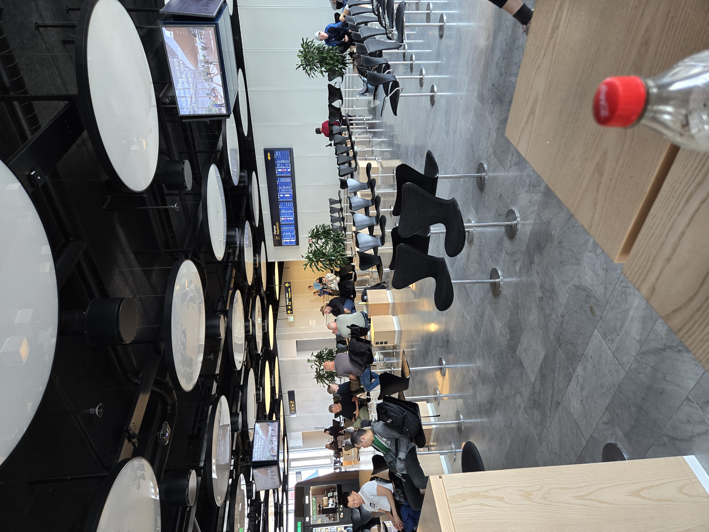

Da jeg ankom til lufthavnen var jeg en smule bekymret for om hvor lang tid det ville tage at skulle komme i gennem alt sikkerhedskontrol, eftersom jeg synes det var rigeligt med mennesker. Det tog dog kun 20-30 min og så sad jeg ved gaten mod abu dhabi første stop på rejse med korea. Her må jeg dog sige der er virkelig ikke så mange mennesker som jeg havde troet

Så jeg håber det bliver ved sådan så jeg kan sidde for mig selv :) 

## flyve turen
Det blev dsv ikke som jeg havde håbet, det var 2 helt fyldte fly. Jeg havde dog heldigvis betalt list ekstra for mere ben plads så det var stadig helt perfekt at flyve til abu dhabi. Vi lanede 30 min foran tidsplanen, så det betød jeg skulle 
Vente i 2 tiner og 30 min på flyet mod korea. Hvilket ikke var et problem men at flyet mod korea så kommer forsemt så jeg skulle vente 3 timer i det hele og så var det forsinket i at lette så vi endte med at være 2 timer forsinket så landte først kl 11:50.

## Pas Kontrol
På vej ind i korea havde jeg sørget for at have alt i orden havde vaccine kort pas osv men vidste ikke man også skulnr have noget der hedder E-pass, så begyndte at gå i halv panik indtil jeg opdagede man kunne lave et mens man stod i lufthavnen, så jeg stiger ud af køen for at lave dette pass. Hvad sker der så når jeg kommer hen til kontrol? "Sir we dont need the E-pass" og der må jeg sige at jeg stod som det største spørgsmålstegn. Men hey jeg kom igennem og kom med shuttle bus mod min airbnb (laver en post om den)

## Resten af dagen
Mathias min ven fra folkeskolen var rigtigt taget til Kina om kom måske forbi korea ved d. 18 august men der var så varmt i Kina og han havde problemer med at få wechat (Kina's "google" du kan ikke gøre noget uden wechat) Til at fungere, så han er taget til korea nu. Vi mødtes op og har brugt hele dagen fra kl 14 - 21 på at gå rundt i byen. Vi havde ikke rigtigt et mål bare gå og hygger, og det var det. Dog måtte vi erkende at selvom vi havde forventet at det ville være varmt havde vi ikke forvent 36 grader med fugtighed på 87% HELE dagen. Nu er kl 21:21 og vi har været hjemme og i bad og skal til at finde ud af om man tager ud og ser by liv eller går i seng (ender nok med at blive den første ;) )

