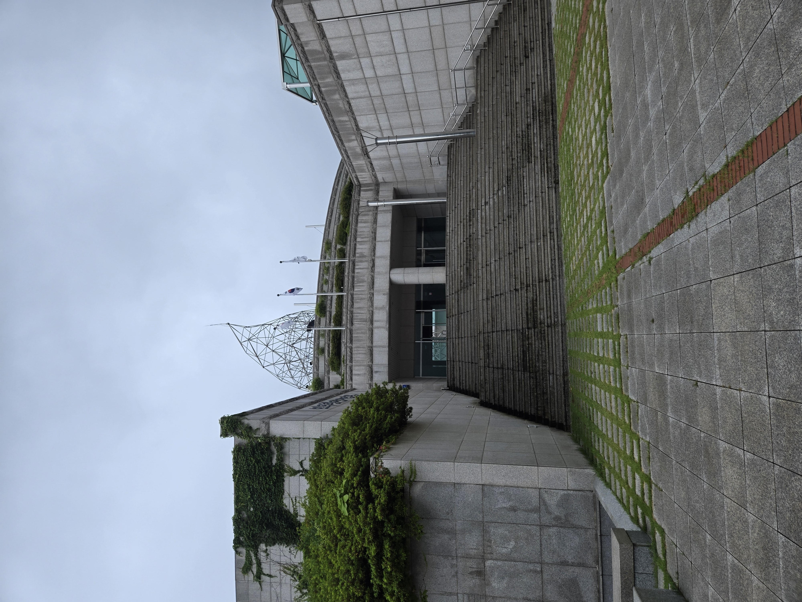
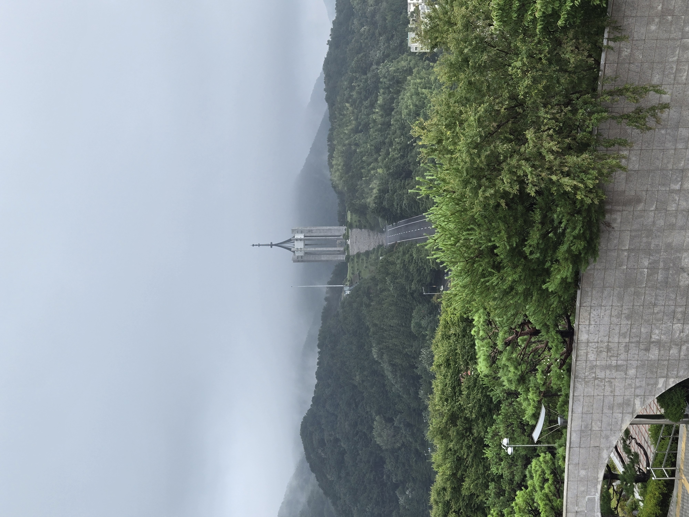
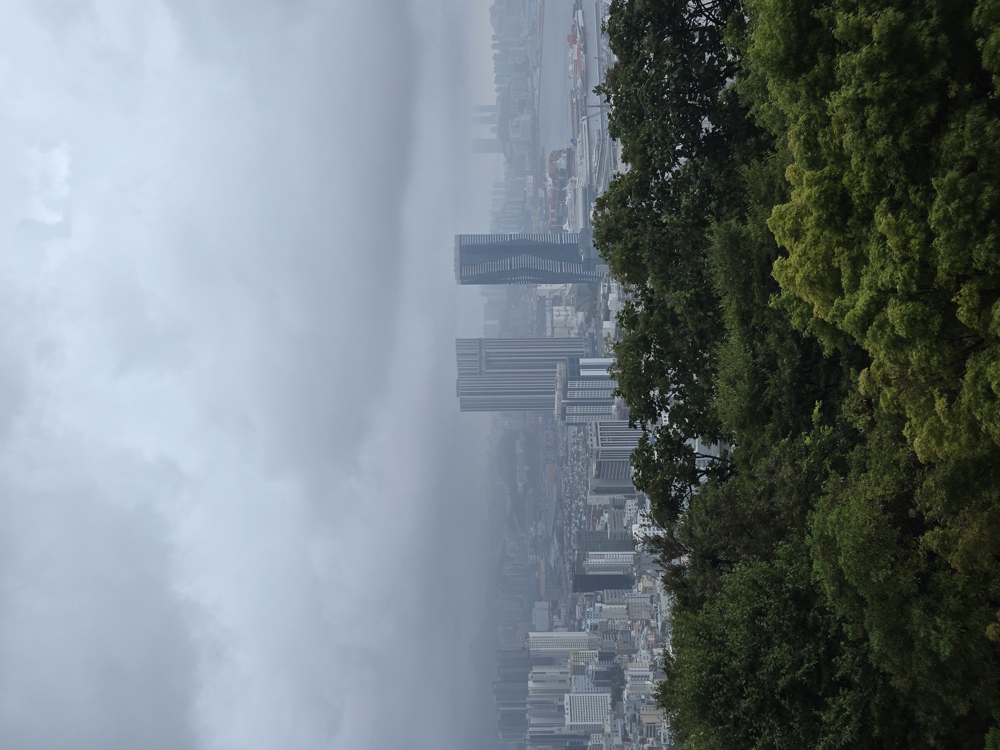

## Gaden 

Igår havde jeg aftalt med Mathias vi skulle mødes kl 8 ved busan station fordi vi skulle til haeundae i dag, og det tager ca. 1 time at komme hen til, men da jeg ankom var han der ikke og han svarede ikke på mine beskeder så tænkte han sikkert lå og sov så skulle finde en måde at bruge tiden på imens jeg ventede. Jeg havde glemt at tage en belte/mave taske med, så jeg tænkte jeg kunne tage i uniqlo og købe en. På vej der hen så jeg noget på jorden om forskellige ting man kunne se i nærheden af der hvor jeg var. Tænkte ikke så meget over det og fortsatte mod uniqlo. Det eneste problem er at det ikke kun var gangnam hvor alt først åbner ved 12 tiden, det gælder åbenbart for hele korea så jeg stod foran uniqlo kl 8:30 og tænkte gad vide hvad jeg så skal lave.

## Busan tower

Jeg opdagede der en mærkelig vej op bag alle husene, så jeg tænkte den skal jeg selvfølgelig op af, det var en lang vej der snorede sig rundt om et bjerg og på vej op mødte jeg en gruppe af 2 ældre herre og en kvinde. De begyndte at tale til mig og "lære" Mig hvordan man skulle gå op af bjerget ved at skifte mellem at gå forlæns og baglæns så du fik mindre ondt i benene. På vej op af bjerget begyndte det pludselig at styrte ned, så jeg tog læ under et træ, men fik af fortalt af de andre at jeg bare skulle følge med dem, fordi vi var næsten på toppen hvor der var halvtag. 

Jeg må sige at vejret her henne er meget underligt der er byer på 10min og så stopper det i 30 og så kommer de igen. Dette fandt jeg nemlig ud af da regnen stoppet og de bare begyndte at gå igen hvor jeg sad og tænkte "uhm det kommer da stadig til at regne igen om 2 min?".

På toppen af bjerget ligger busan tower, ikke rigtigt noget specielt bare et tårn der står på et bjerg 🤷‍♂️. Der var dog nogle få flotte statuer. Men så var det ellers bare ned igen fordi nu var kl 9:30 og Jeg tænkte Mathias må være vågen nu.

### billeder fra busan tower

|  |  |  |
|---------------------|---------------------|---------------------|
| Drage statue          | General       | blomster ur           |
​

## Democratic park
### turen til toppen
Som de smarte af jer nok har gættet var Mathias ikke.... stået op...

Men jeg kom sjovt nok forbi det jeg så på jorden igen så tænkte, måske er der noget på den der kunne være sjovt at se

Har så jeg Democratic park viewpoint, og tænkte der skal jeg da hen. Så på maps der stod det kun var 1 km væk men der stod også det ville tage 1 time. Jeg tænkte ikke så meget over det tænkte bare det var maps der løj som normalt. 

Neeeeej hvor tog jeg fejl det var bare op op og atter op.

|   |     |  | 
| --- | --- | --- |
| de første 20 min |  efter 40 min   |  de sidste 10 min   |

Det var hårdt men turen her op var også sygt smukt, og på siden af bjerget var det bare et trænings center og en Crockett bane.

### På toppen
Det første jeg fandt var et monuments til soldater unden korea krigen

Her er der ikke så meget mere at sige.

Jeg gik lidt videre og kom til et bygning

Det var en kæmpe bygning med fantastisk udsigt ud over hele busan

|    |     |
| --- | --- |
|   memorial af faldne soldater  |   busan  |

Jeg fandt ikke ud af hvad bygning var fordi jeg så det kæmpe tårn på billede 1 og tænkte der skal jeg også hen så jeg sprintede med det samme videre.

Det historien her er stort set den samme så det behøver i ikke at høre, men Mathias vågnede endelig og så var kl 11 og afsted til haeundae med os.

---
