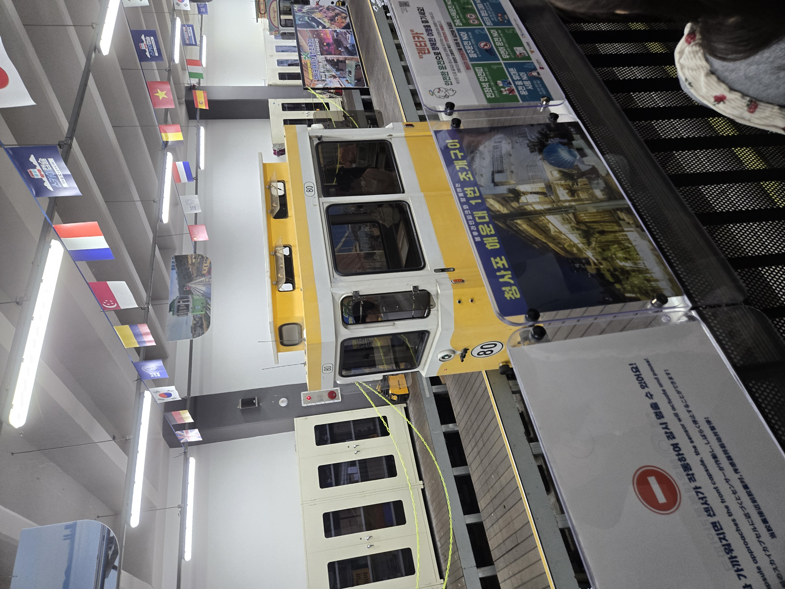
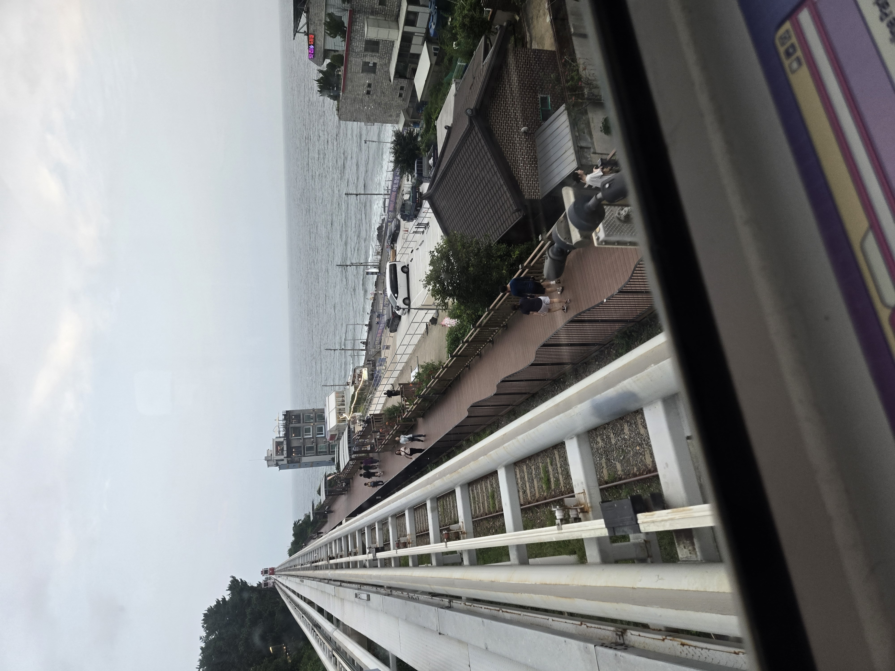

## Ankomst

Der var to ting vi gerne ville i haeundae 1. Køre i deres "sky rail" 2. Se den kæmpe strand de har. Vi startede med stranden

Ville dog ønske jeg kunne sige noget om den, det var en strand som alle andre ikke rigtigt noget specielt, men det var også meget rart fordi der var en masse vind som oven på 30+ grader føltes fantastisk. Vi ankom til sky railen kl 14 og så der var en KÆMPE kø og vi havde selvfølgelig ikke bestilt billetter. Så vi begyndte st panikke om vi overhovedet kunne fordi online stod der man først kunne bestille billetter til kl 21 og det gad vi ikke rigtigt. Så vi begyndte at gå hen til alle menneskerne, indtil Mathias opdagede det var den forkerte kø. Der var bare en maskine hvor man kunne købe billetter og der kunne man få billetter til kl 19 og solnedgang var kl 19:20 så det tænkte vi at vig tog. 

Nu skulle vi bare få tiden til at gå, så vi så der var et akvarium i nærheden, som vi så besluttet os at tage hen til, selvom jeg er imod zoo og det.

## Akvarium 

Der er ikke så meget at skrive om her, det var et akvarium. Det var meget stort og flot og vi fik brugt ca. 2 timer der inde. Der var dog en glas tunnel man kunne tage der gik igennem det ene akvarie, hvor jeg fik taget et billede af en glad lille fyr

## Sky rail
Kl blev 19 og vi skulle op i sky railen det er sådan en lille sjov vogn man sidder i.

Som så køre på skinner ud mod havet, det var en meget hyggelig tur, men vi var begge enige om at det nok havde været federe at gøre en dag med mere sol

|    |   |
| --- | --- |
|i vognen     | i vognen 2    |

Og det var enlig det fra haeundae (som jeg magter at skrive om😅)

---

