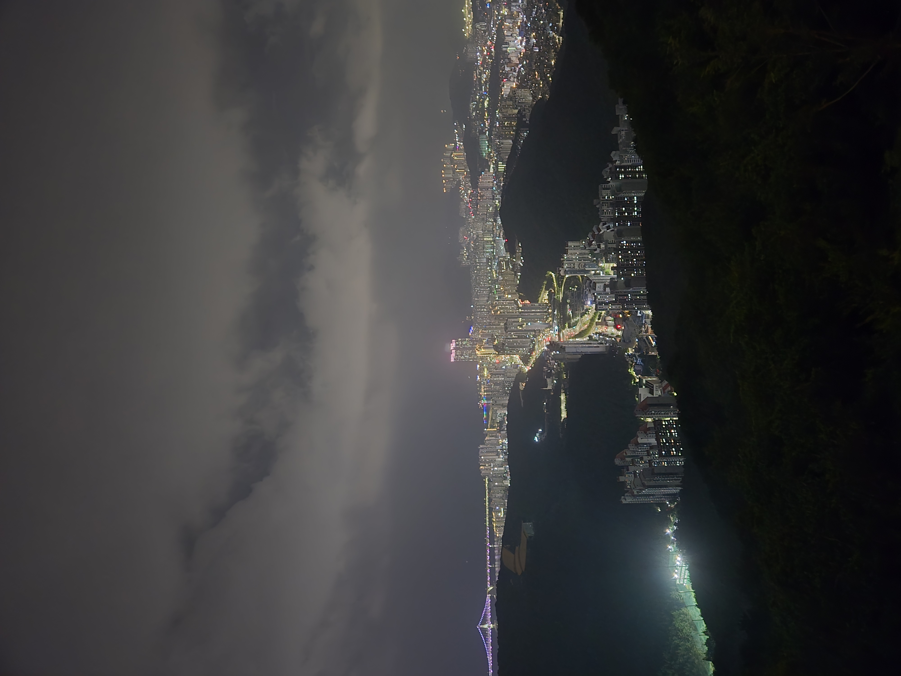
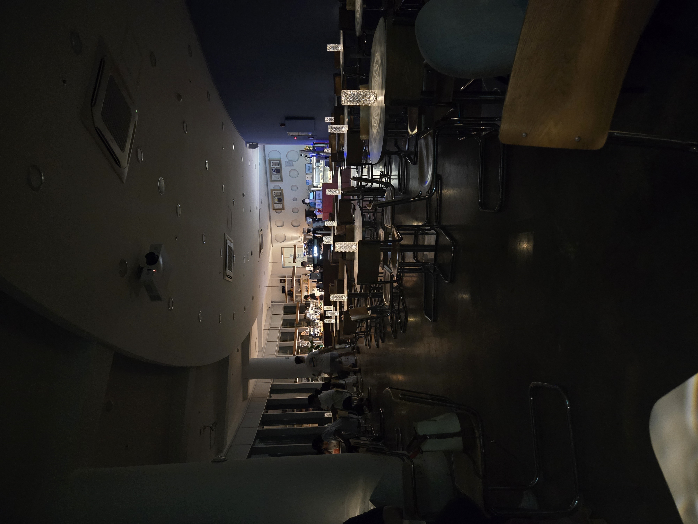
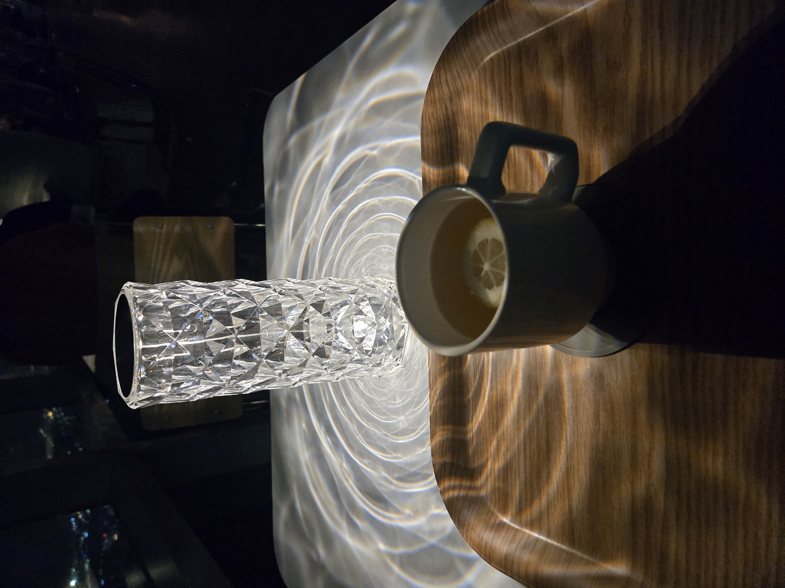
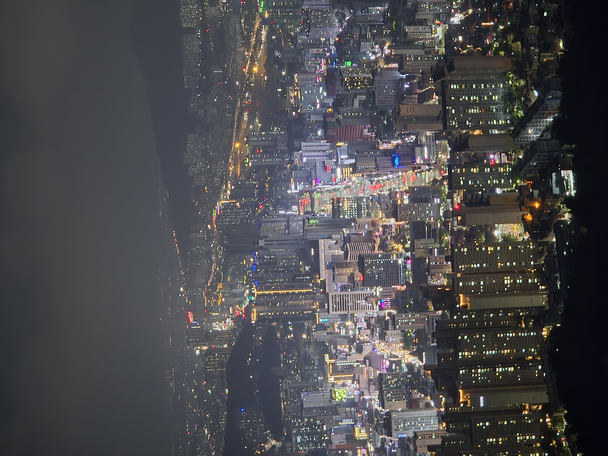
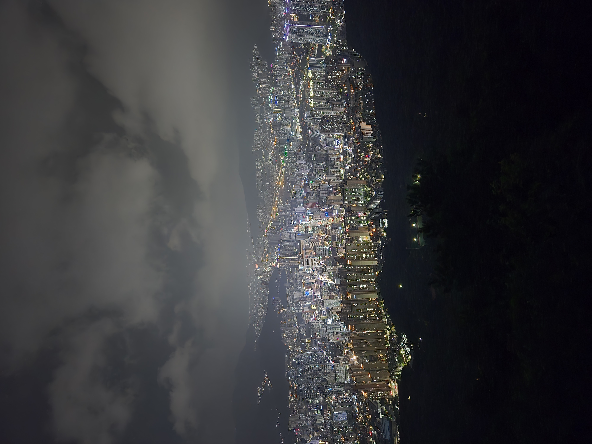
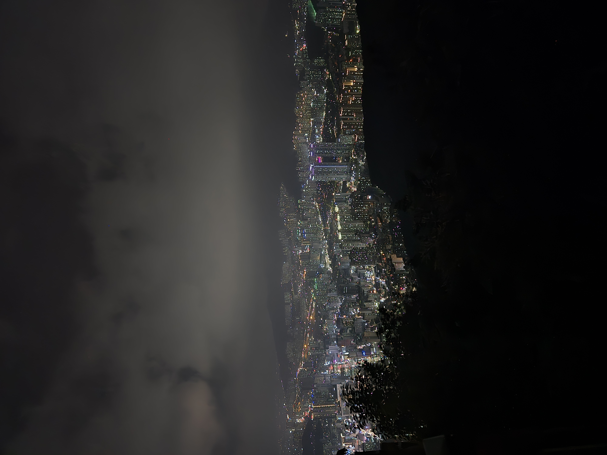
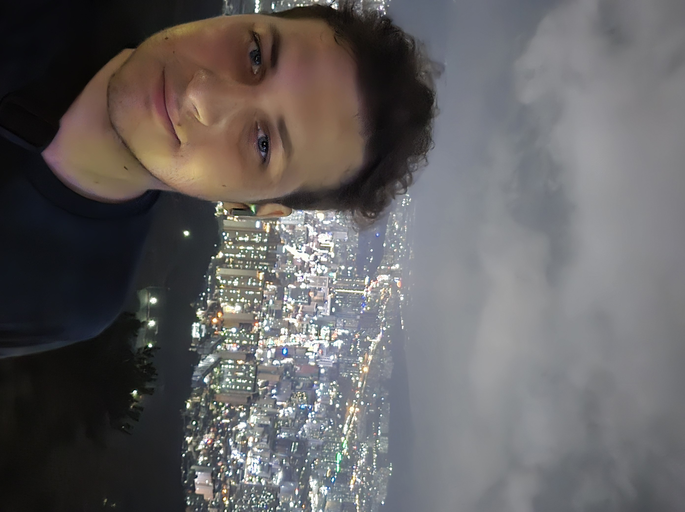

## Turen op af bjerget

Jeg blev sat af på foden af bjerget af en bus og så skulle jeg ellers bare gå op af i 2km med en hældning på 15-20%
 
det fortsatte bare op og lignende ikke at det havde tænkt sig at stoppe og man skulle gå helt ude ved bilerne så det var ikke fordi man følte sig helt tryk specielt når man kom højere op
![[20250806_201144.jpg]]
Men på med musikken og så fortsæt op af fordi jeg vidste det nok ville være det hele værd

## toppen øst

Oh ja det var det hele værd det jeg kom til var nok den pæneste udsigt jeg længe har set

Har taget mange flere billeder kan bare ikke sætte dem alle ind ville tage for lang tid. Men jeg stod og stirret mundlam i 30 min og bare kiggede, indtil jeg opdagede der en cafe med udkig ud til det hele 

| |   |
| --- | --- |
|  cafeen   |  min te    |

Det var faktisk en perfekt oplevelse jeg tænkte ikke den kunne blive bedre, det var indtil jeg så jeg kunne komme højere op.

## toppen vest
Jeg ville ønske jeg kunne tage billeder med mine øjne og sende dem fordi et kamera fejler hvor smukt det var

Og fordi jeg vidste alle i familien ville have et eller andet billede af mig tog jeg det her hvor jeg ligner en kartoffel

Jeg stod her i faktisk 2 timer indtil jeg blev nød til at gå ned fordi ellers ville jeg ikke nå min bus og så skulle jeg gå hjem i 4 timer. 

Kan ikke understrege det nok hvis du er i Sydkorea kom til Hwangnyeongsan mountain om aften/natten bedste beslutning du nogensinde tager.

---
