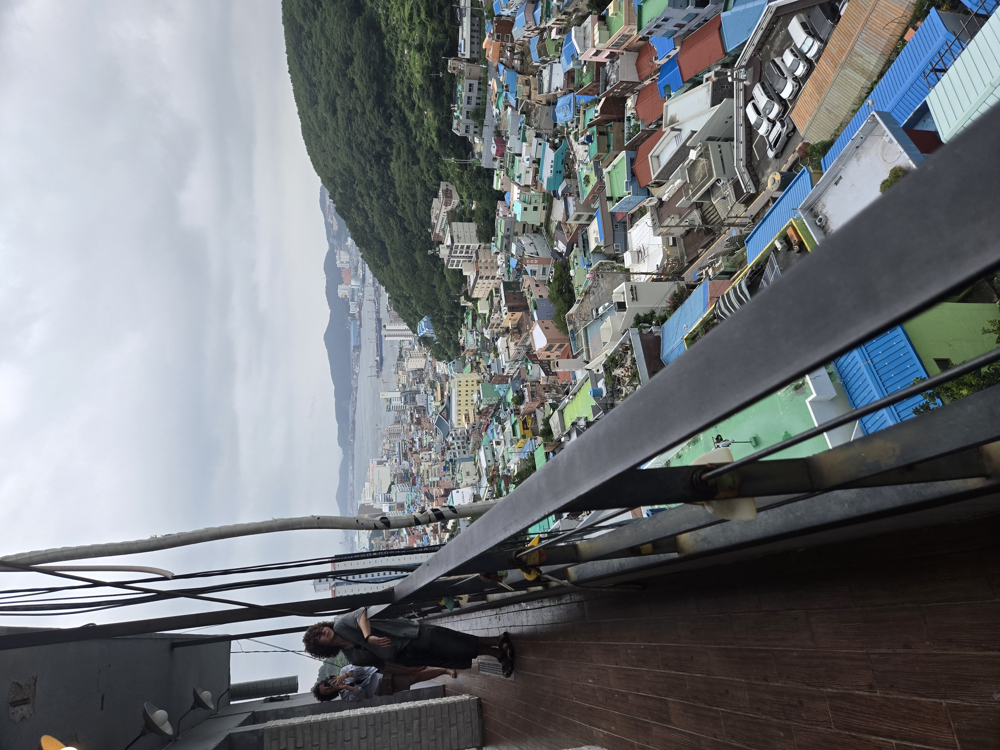

## Ankomst 

Vi tog busen til landsbyen og sekundet vi stiger af bliver vi spurgt af en person om vi vil deltage i en tourist undersøgelse for busan. Vi skulle ikke betale noget eller skrive nogen personlige oplysninger ned og han sagde det kun var en side så vi tænkte hvorfor ikke. Ha ha ha det var meget mere end side hele det var 11 sider af tilfældig ting vi havde gjort i busan vi skulle udfylde så efter at have brugt 20 min kunne vi endelig komme igang. Og jeg siger dig der landsby var hyggelig og pæn

## Rundt i landbyen

Vi brugte de næste 3 timer på at gå rundt i landsbyen, og nej hvor var den pæn, Mathias og jeg var begge enige om at det var en sygt fedt sted men vi kunne ikke tænke os at bo her, fordi hele landsbyen var bygget på en bjergside så man kunne godt mærke det i benene efter at have gået rundt i noget tid. Vi fandt også ud af korea åbenbart elsker den lille prins. Han var over det hele i landsbyen der var skulpturer malerier og alt muligt af ham. Glemte dog at tage billeder af ham.

Vi gik lidt mere rundt og kom forbi en cafe med udsigt over hele byen så her sad vi og fik en lemonade

|    |    |
| --- | --- |
|  byen 1   |   byen 2  |

Og så var det hjem af fordi kl var blevet 17 og jeg havde planer om at bestige et bjerg kl 19

---