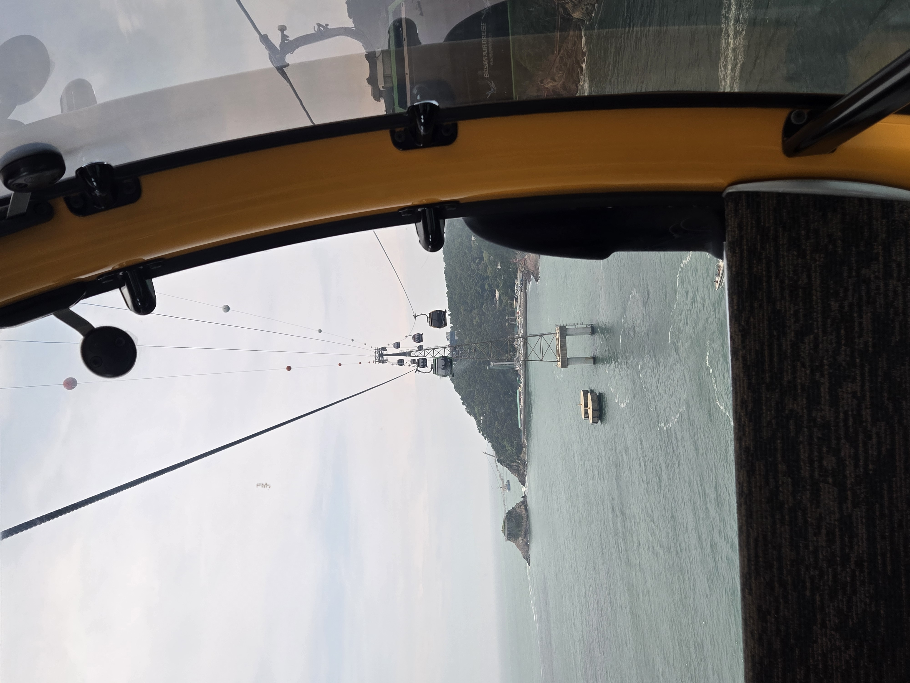
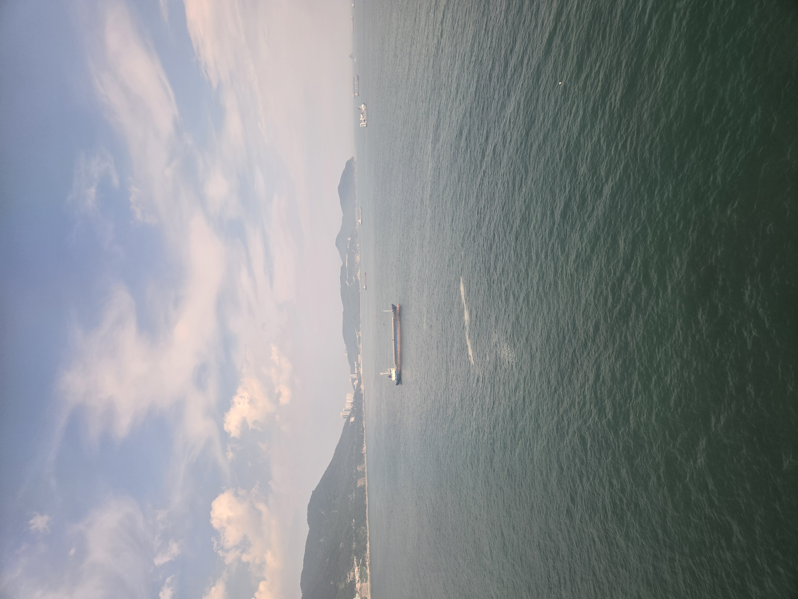
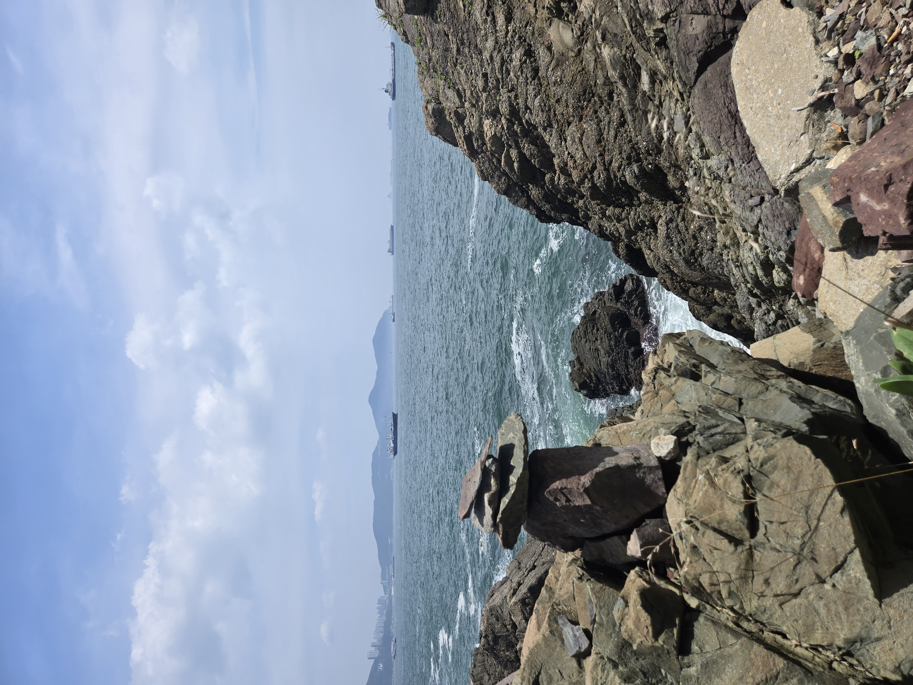
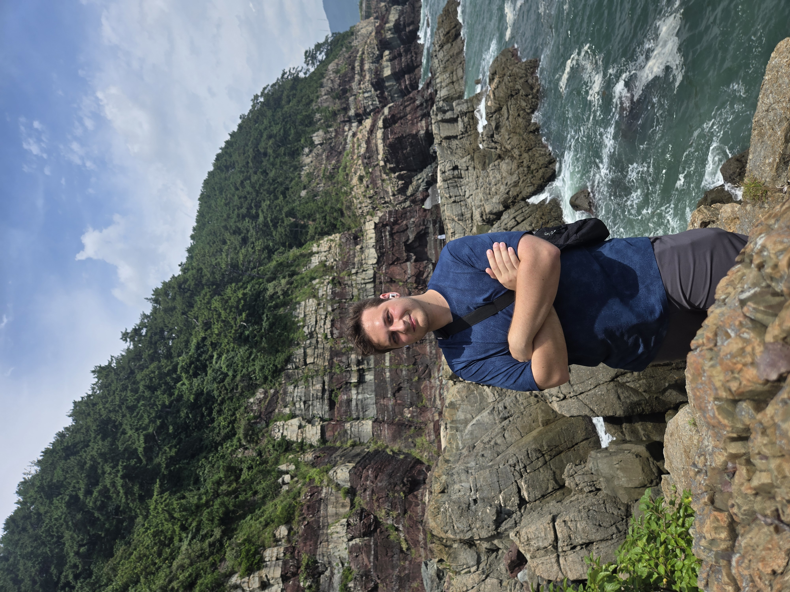
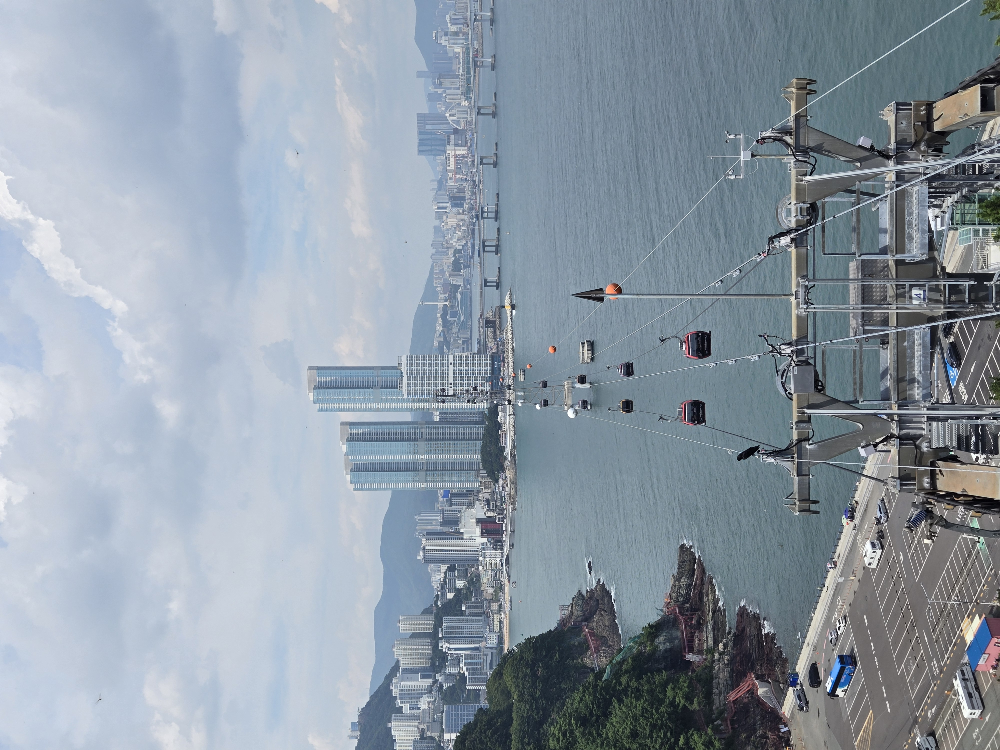

## Morgen panik
Vi havde aftalt at vi ville tage I cable car i dag så vi skulle mødes ved en 10 tiden og tage dr ud fordi en stor forskel der er på Mathias og jeg han kan godt lide at sove i de 10 timer og jeg kan lide at sove i 4 timer. Så mens Mathias lå og sov chekede jeg om man kunne book online, her begyndte jeg panikke en smule fordi der stod man kun kunne bestille til d.8 og der havde vi lidt et tog vi skulle nå kl 11 så det kunne vi ikke. Skrev derfor til Mathias kl 9 jeg tager ud og ser om man kan få billetter til i dag. Kom der ud kl 11 med perfekt vejr sol og hele molevitten perfekt til at være i cable cars. Jeg så at andre var igang med at købe billetter så jeg skrev med det samme til Mathias at vi godt kunne, og at han skulle skynde sig mens vejret er godt. Vejret er nemlig rimelig tilfældigt her henne. Han svarede tilbage efter 30 min at han er 40 min væk så jeg checker vejret der står der er sol til kl 14, så han kan sagtens nå det. Men har er simpelthen taget ud og boulder fordi han bare gik ud fra der ikke var billet. Så vi blev begge enige om jeg bare tog den alene.

## cable car
Jeg får så bestilt min billet og afsted med mig

|     |     |
| --- | --- |
|   cable 1  |  cable 2   |

Turen med cable caren er meget stille og rolig en 10 minutters tur fra A til B

Platformen på den anden side var prob fyldt med alle mulige street food vendor og Jeg siger dig det duftede godt. Jeg fortsatte rundt og gik opdagelse og så de havde forskellige udstillinger

Og fortsatte længere frem til jeg kom til en skov, her så jeg på et skilt at der var en 4km rute rundt om bjerget så den skulle jeg selvfølgelig ud på, uden vand eller noget som helst....

## Klipper

Efter at have gået i 20 min kom jeg til nogen klipper og hvis i kender mig ved i at jeg skulle rundt og gå på dem😁

Og nogen selfies fordi alle spørger

## Videre på ruten
Der er så meget at skrive om at jeg ikke ved hvad jeg skal skrive om, så her må jeg bare sige når jeg kommer hjem kan i spørge ind til det og så kan jeg have alle billederne parat

## aften

Efter gå Turen tog liften ned igen og spiste noget aftensmad mad og hoppede i seng mine ben var smadret

---
