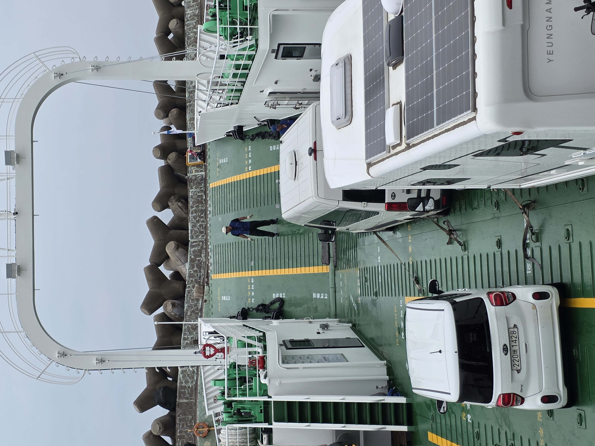
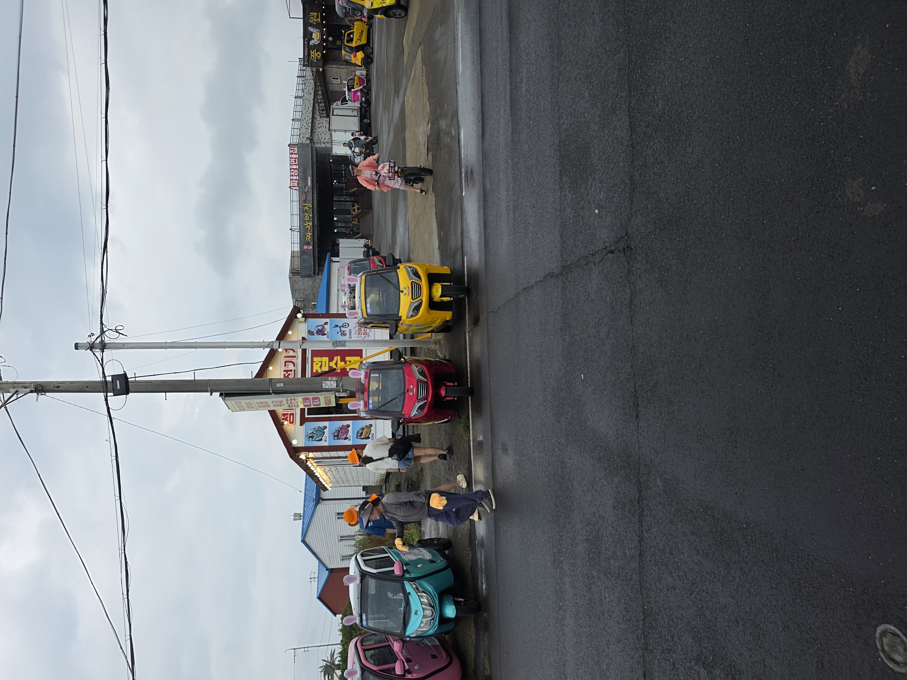
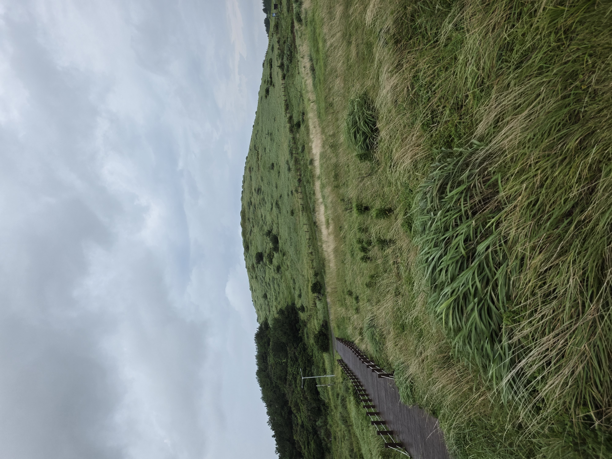
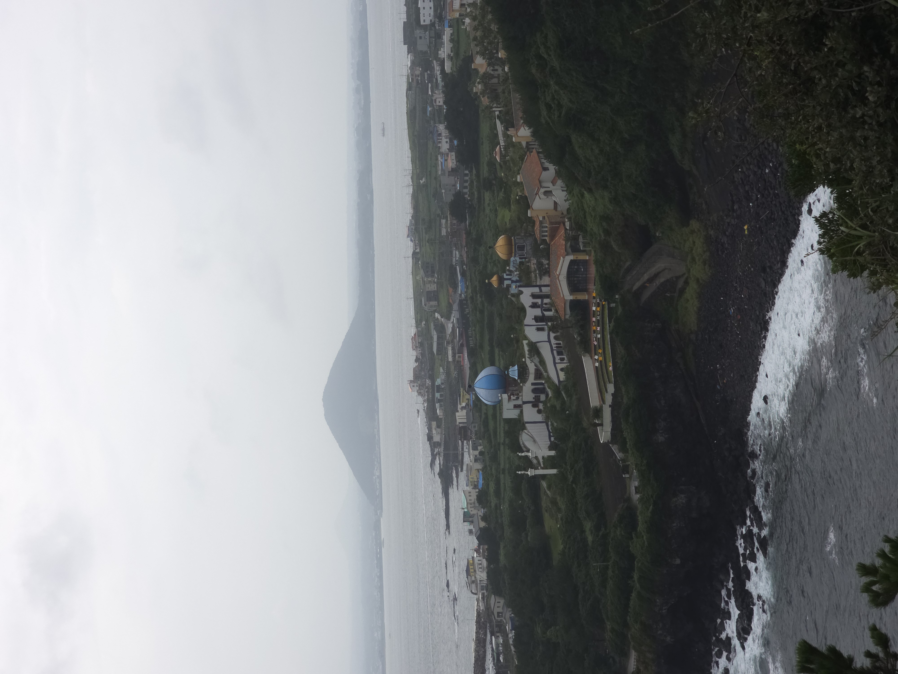

## Udo tur
Igår fløj jeg mod jeju en ø i bunden af syd korea, Mathias gad ikke med så jeg tog afsted alene. Jeg landte kl 23, så der var ikke så meget at tale om, jeg fik noget mad og gik i seng.

Kl 8 tog jeg afsted fra mit hotel og tog mod en færge jeg kunne tage hen til en ø der ligger øst fra jeju en lille ø kaldet Udo. Udo er ikke rigtigt kendt for så meget, de er kendte for en specielt form for svin, peanuts og naturen, hvis I har fuldt med ved I godt hvorfor jeg ville der hen. Det var selvfølgelig pga svin.... ej det var selvfølgelig naturen.

### Færgen
Færge turen der hen var meget stille og rolig flot udsigt til havet og en anderledes måde at bygge både på, udover det stod personalet bare på spisen af båden

Det så alligevel rimelig sjovt ud, jeg har også opdaget at nogen koreanere synes jeg er en "alien" der var en dreng der tog billede af havet ind til han lå mærke til jeg stod ved siden af ham, så vendte han kameraet direkte mod mig og tog et billede, jeg var åbenbart en meget mærkelig skabning. Udover dette skete der ikke så meget.

### Ankomst på land

Det første jeg så da jeg ankom var en meget spøjs skuter 

Jeg døbte dem her kanin skuterne, jeg må være ærlig hvergang jeg så en kunne jeg ikke lade være med at fnisse en smule til mig selv. Jeg synes de så godt dumme ud. 

Jeg havde læst mig frem til at der var en pæn strand henne af vejen, så jeg begyndte at gå videre. Jeg må sige den her strand ville nok have været rigtig pæn hvis ikke det fordi det regnede 24/7 mens jeg var der.

Som i kan se var det rimelig gråt mens jeg var der. Men hey jeg er ikke den samme dreng jeg plejede at være, som begynder at vræle og skrige fordi hans tøj blev vådt. Så jeg forsatte med at "vade" dette er endt med at blive mit nøgle ord på ferien, hver gang jeg ikke ved hvor jeg er eller hvor langt der er til et sted siger jeg bare til mig selv "hey jeg vader bare der ud af".

### Fyrtårnet

Ikke så langt fra stranden ligger der er et fyrtårn og det tænkte jeg det skal jeg da op i, så jeg begyndte at vade der hen, i sjask regnvejr. Jeg gik og talte med nogen venner på telefonen mens jeg gik fordi de stadig var vågen, og har ikke talt med dem siden jeg tog afsted. Men da jeg ankom til bakken op til fyrtårnet var jeg nåd til at ligge på, der blæste simpelthen så meget at jeg var ved at blive blæst væk, så jeg fortsatte op i stilhed gad ikke høre musik fordi der var så pæn en udsigt

Det eneste problem er hvor gråt der var men jeg lod det ikke på virke mig. 

Efter at have gået I noget tid kom jeg til en sjovt sted, på vej mod fyrtårnet var der simpelthen et fyrtårns museum der var en masse fyrtårn fra hel verden men der var et det virker meget bekendt.

De havde simpelthen Anholts fyrtårn, det må jeg være ærlig og sige jeg ikke havde regnet med. Uheldigvis var det en af de mere interessante ting der var der, der var nemlig så gråt af regn at man ikke rigtigt havde en udsigt fra fyrtårnet

### Grotte
På vej ned fra bjerget fandt jeg en Grotte nede ved stranden, ja ved stranden efter det havde regnet... en klog person ville måske have lyttet til de 6 forskellige advarsler de havde fået på deres telefon omkring oversvømmelse, men hey jeg kan ikke læse koreansk, så jeg gik ind i grotten.

Jeg sad her i nogle minutter indtil jeg synes jeg ubevist gik højere og højere op, så jeg valgte at holde øje med et sted på væggen, og ja mon ikke vandet var igang med at stige. Afsted med mig, jeg begyndte at klatre langs vægen af Grotten ind til jeg kom ud, da jeg kom ud og op på vejen igen var der også en koreaner der havde set det hele der sødt spurgte, "are you alright, i saw you enter and was ready to call for help". Måske man skal lade være med at presse skæbnen en anden gang 😅

### Resten af udo
Her efter regnede det så meget at jeg ikke rigtigt har nogen billeder gik på lidt flere bjerget og gik på nogen klipper, men ikke noget nyt, så det var bare tilbage til færgen og tilbage til hotellet for at skifte tøj og oplade tlf.
