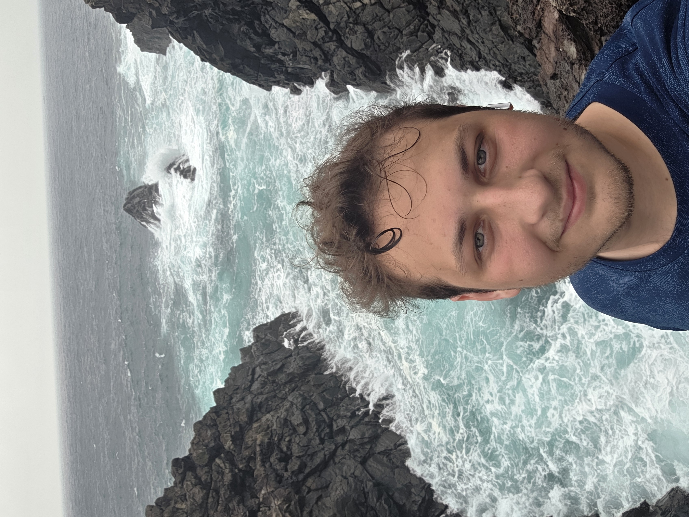

## Vandfald
Jeg startede med at tage mod et vandfald jeg havde læst skulle være meget pænt og skylde direkte ud i havet, men som temaet af den her jeju tur fortsætter var der så meget regn at det så rimelig gråt ud.

Men det skal lige siges, mest pga min mor, jeg havde stadig en fantastisk selvom det regnede det gin kun ud over billederne, så i skal ikke side og tænkte "nej hvor er det trist han ikke havde sol"

Jeg ville gerne have været klatret op af klippen op til vandfaldet, men den her gang var den koreanske stat foran mig, de havde spæret hele vejen af med politi fordi det regnede så meget at der var chance for jordskred, så det fik jeg ikke lov til selvom jeg spurgte pænt.

Efter vandfaldet tog jeg afsted til gæt hvad...... endnu en klippe.

### Stor sten
Det er meningen at havde ting ved den her klippe er en stor sten der er i havet.

Altså ja det er en flot sten men ja føler der kunne have været bedre ting at se.

Så derfor valgte jeg at bruge min superkræft her henne, jeg kan ikke læse koreansk, så over hegnet med mig og ned af klipperne, jeg kan godt sige at det var klart sjovere end at se på 😅

|     |  |
| --- | --- |
| klippe    |  selfie  |
Jeg tilbragte det meste af dagen ved at klatre på klipper her omkring så der ikke så meget mere at skrive om her.
