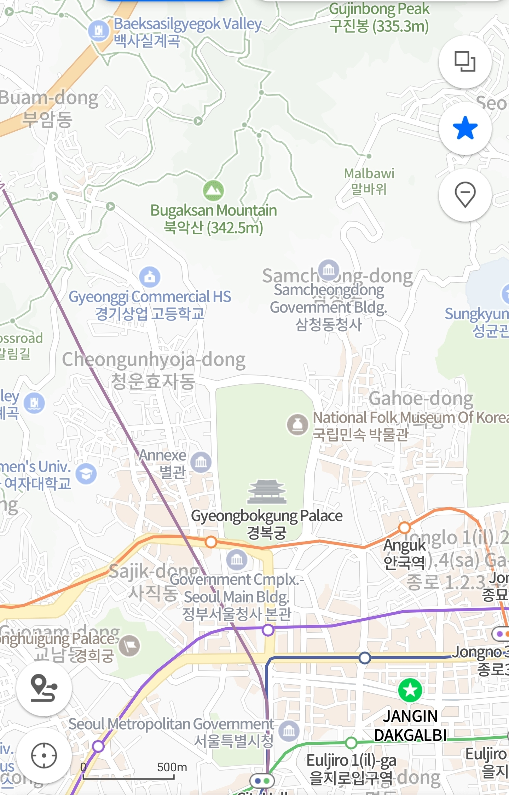

## Temple

I dag besluttet Mathias og jeg os for at tage til et kæmpe temple i midten af seoul, jeg kunne ikke rigtigt finde ud af hvad templet var for og hvad det betød, men fandt ud af at tilbage i 1940 eller 50erne brændte japanere ned og det er siden blevet genop bygget

Det var et kæmpe temple og der var en helt masse mennesker, måske lidt for mange for min smag haha.

Bare lige så i kan få en ide om hvor stort det er det grønne er templet

Så ja det var ret stort.

Bag ved hovede templet var der en lille sø med endnu et temple ting ting i midten af den

Det synes jeg så rimelig flot ud, men der var desværre ikke noget skygge og solen havde et uv index på 9 med 33 graders varme så vi stod ikke i lige så lang tid som jeg gerne ville have stået i.
## museum 
I samme park som templet var der også et museum, det var et museum om koreansk folke historie. Det var alt fra om hvilke ting de havde vundet i sports turneringer til traditionelt tøj og skikke.

Det var det for den dag

---

