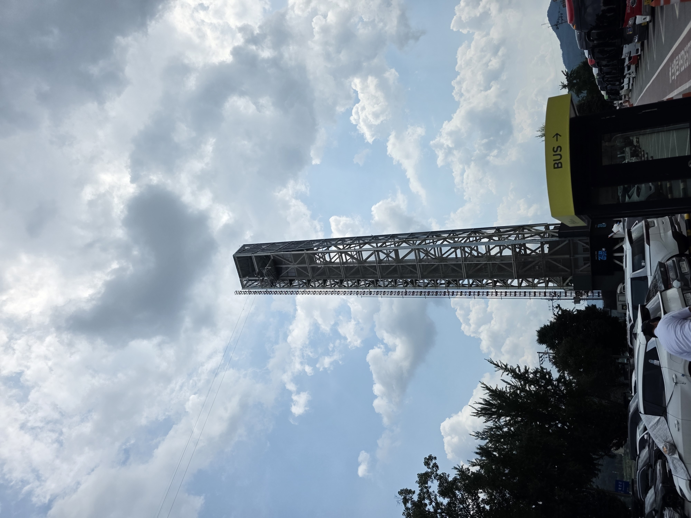
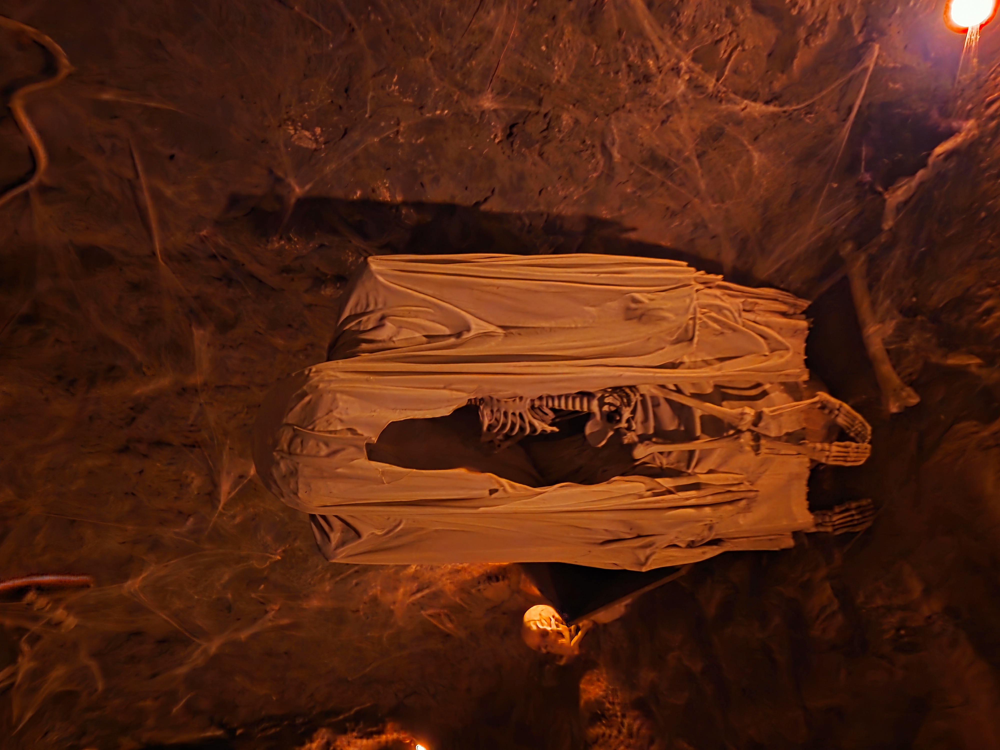
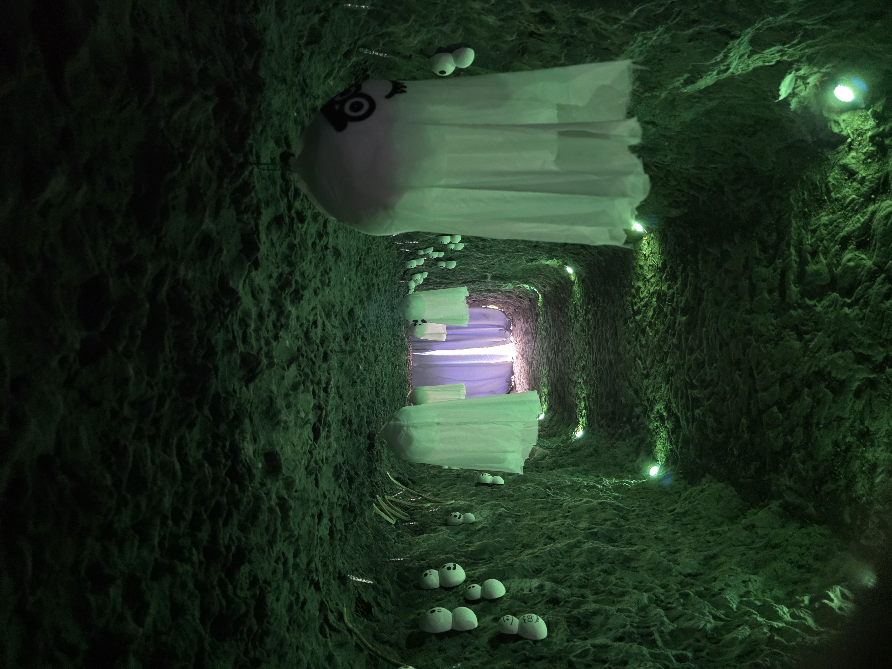

## zipline
I dag tog jeg med lyn tog 2 timer ud fra seoul fordi jeg havde set der var en zipline man kunne tage over vandet på ca. 1km der kørte med 80km/t så det skulle man selfølgelig prøve, man måtte dog ikke tage billeder i mens så har kun dem her

|    |   | |
| --- | --- | --- |
|Tårnet med ziplinen   |Det man skulle have på   |billede af ziplinen fra slutningen|

Det her var den første gang jeg synes det havde været federe at være afsted med en anden en bare at være alene, fordi Xander ville have elsket det lige så meget som mig. Mens jeg sad og fløj afsted kunne jeg ikke lade være med at smile og grine over det, der er et eller andet ved følelsen af bare kunne mærke vinden suse forbi dit ansigt.

## Nami 
På nami island valgte jeg først at gå i yderkanten af øen og ville så gå i midten på vej tilbage.

Der var ikke så meget at se i yderkanten, bare flot natur og nogen sjove hus

Men ind mod midten var der straks mere at se. Jeg fik også en ny ven, jeg er åbenbart stadig rimelig god til dyr havde nemlig en påfulg til at følge efter mig i et godt stykke tid den gik bare lige i hælene på vej

Der var også nogen der troede jeg arbejdede der fordi den fulgte efter mig, så de spurgte om de måtte røre den, hvor jeg bare svaret nej. 

Efter jeg havde gået noget tid kom jeg forbi et meget mærkeligt vandfald?

Og ved siden af det her vandfald fandt jeg noget endnu mere underligt

Hvorfor er der en dansk cykel på en tilfældig ø I Sydkorea???? Og lige ved siden af cyklen var der en mand jeg har set en del gange efterhånden

Ja der var simpelthen også et hc Andersen musseum, lidt væk fra det fandt jeg en bakke, som de havde puttet 2 grotte ind i med to forskellige veje

Hvor den røde vej skulle være "scary" Og den blå skulle være "spooky", og nej hvor den skræmmende 

Og den blå var endnu mere skræmmende

Jeg brugte resten af dagen på Nami island og gik rundt landte tilbage i seoul kl 20 spiste aftensmad og gik så i seng

---

