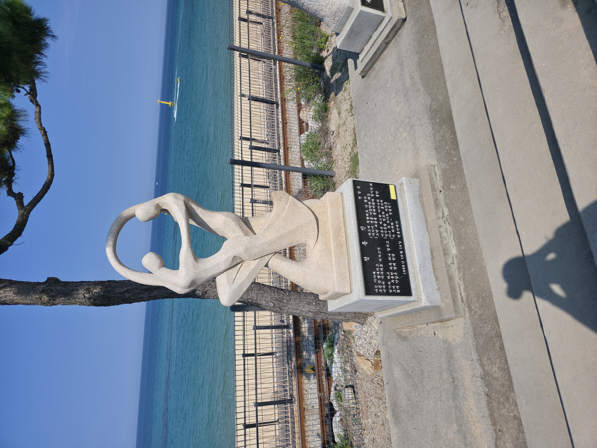

## Morgen 
Som I jo har læst har jeg gået i en del bjerge, så mine ben var døende, jeg ved at vandterapi er en ting for dyr (hunde specifikt) Jeg tænkte derfor hvorfor ikke prøve med mennesker. Jeg havde derfor bestilt en billet til et tog til kl 6:30 fordi den strand jeg ville til lå 3 timer uden fra seoul. Jeg ville dog skulle afsted alene selvom Mathias godt kan lide strand, men han skulle hjem i dag.

Jeg kom hjem kl 5 om morgen fordi nogen af Mathias venner var ankommet til korea dagen inden, så vi var ude og danse moderne (som min daddio ville sige) ind til der.

Jeg hopper i bad skifter tøj pakker taske og når mit tog, og sover hele vejen der hen.

## Jeongdongjin

Jeg ankom til station som åbenbart er et tourist sted? Folk stod og tog billeder af den så det skulle jeg selfølgelig også tænkte jeg

Ved ikke hvad det er men nu har jeg et billede af det kl 10 ankom jeg på stranden, der er ikke så meget at sige om den, den var lang og vandet var helt klart

Jeg brugte de næste 6 timer her ved at bade og ligge og tørre, og det var lige hvad benene havde brug for. 

Kl 16 blev jeg sulten så fandt et sted at spise hvor jeg fik et eller andet, tror det var noget banan tofu, ved bare jeg fik det dårligt af det

Efter jeg havde spist gik jeg op af et bjerg i nærheden og kom ned igen ved en 19 tiden mit tog tilbage kom kl 22 så jeg satte mig ned på stranden for at vente.

## Sjov besked
Mens jeg sidder og venter får jeg en besked fra min airbnb udlejer om at hendes ven står og venter og jeg skal komme tilbage så snart jeg kan. Jeg sidder og bliver en smule bekymret eftersom jeg ikke havde fået afvise der skulle komme nogen, så jeg forklare at jeg først kan være der ved en 1 tiden. 

Hun begynder så at skrive at det er fordi der er en ved døren der siger han er min ven, jeg begynder med det samme at blive forvirret, min ven? Jeg har ikke nogen venner her henne. Skriver dette til hende og hun siger at han hedder Mathias, Mathias? Tænker jeg, fik jeg sagt til nogen hvor jeg boede og jeg er venner med Mathias mens jeg var ude igår? 

Skriver så til hende at jeg kender kun en Mathias men han fløj hjem i dag, kan hun sende et billede, *pling* så sende hun et billede af selveste Mathias fra Danmark. Jeg skrev jo at det var Mathias venner vi var ude med så han var jo også med ude selvom jeg havde sagt det var en dum ide og hvad skete manden missede sit fly. 

Her efter brugte vi hele aften på at fikse hans telefon, som han havde fået låst, men det er nemmere at fortælle om end at skrive så jeg korter det bare ned til. Vi fik fikset hans tlf og sendt ham på et fly dagen efter.

---
*Posted from [Location] on [Date]*
