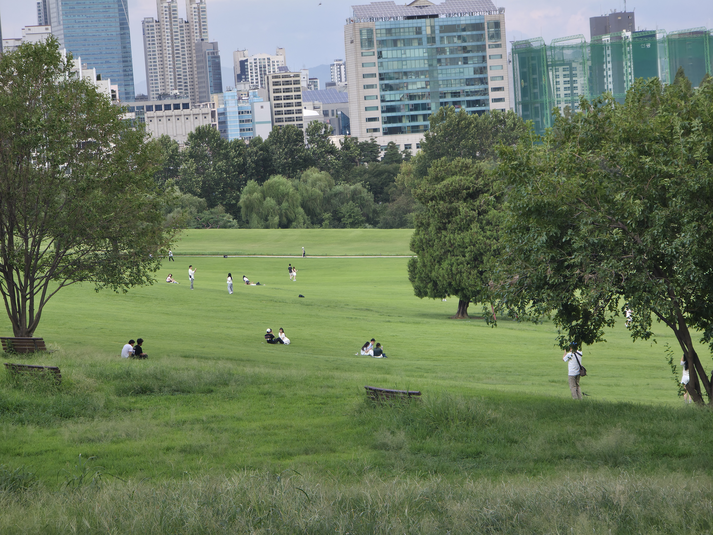
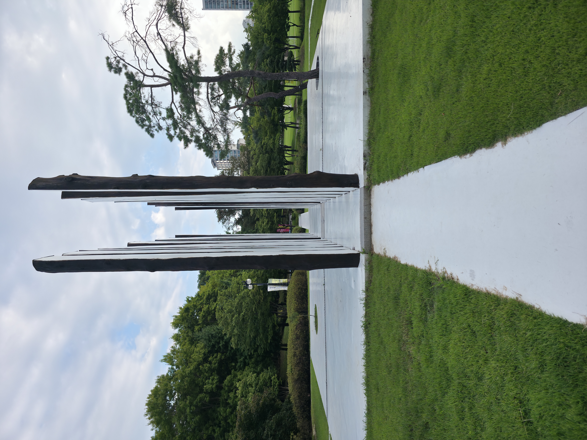
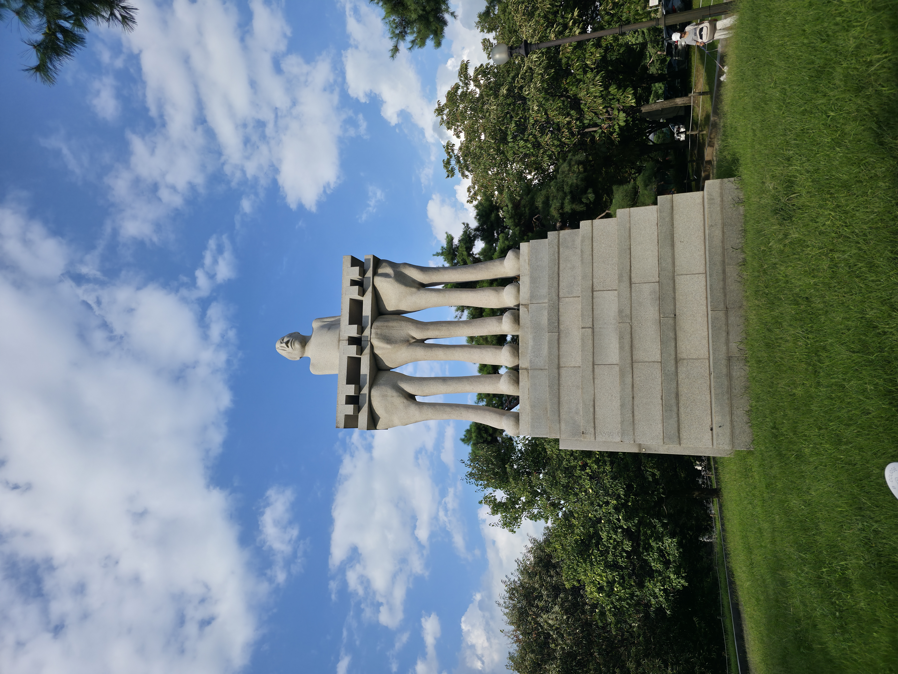
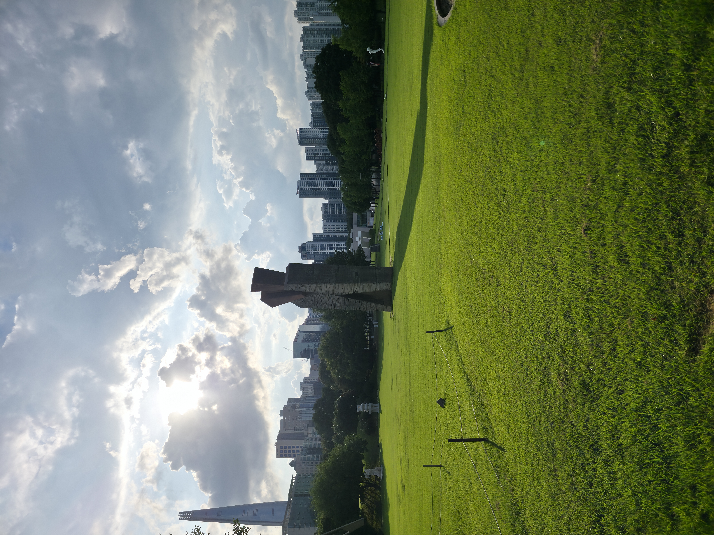
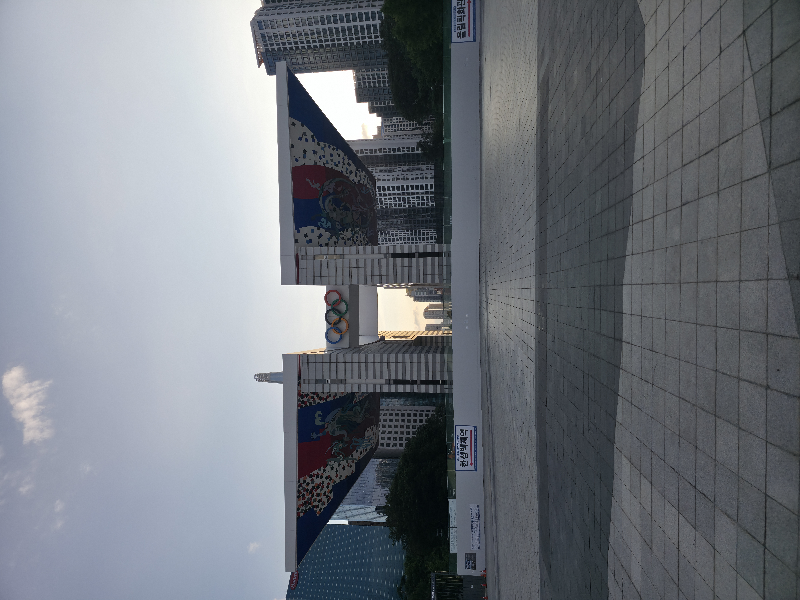
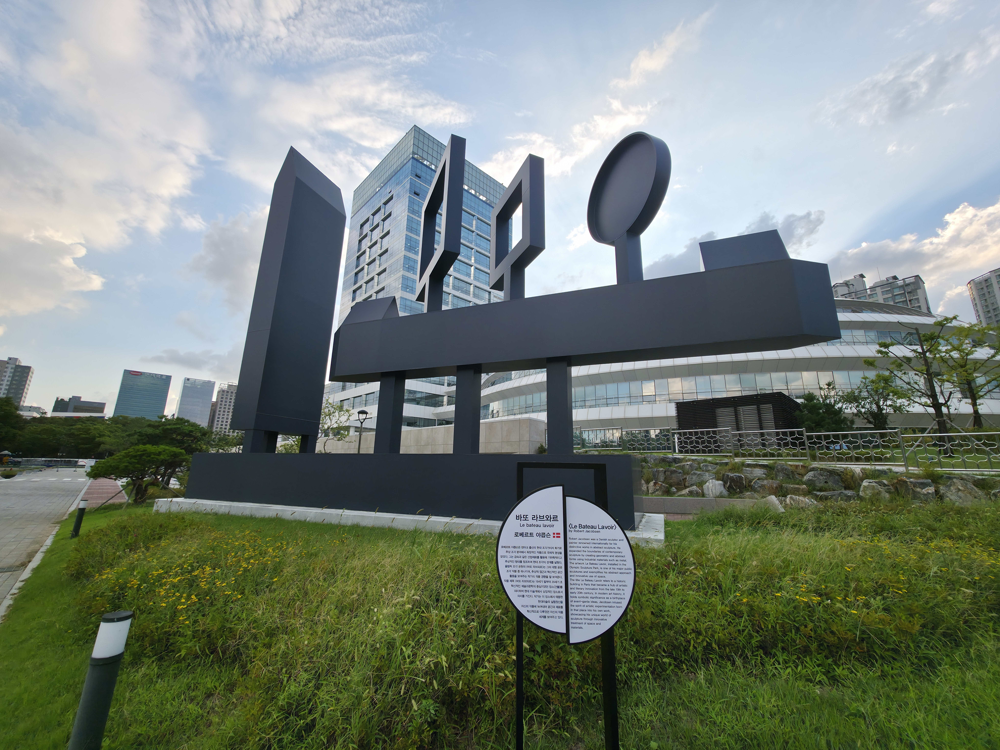

## Olympic park
Pga alt det med Mathias kom jeg først i seng kl 6 så sov til kl 12 før jeg kom ud af døren, så jeg fik ikke lavet så meget i dag.

Jeg havde fundet en forholdsvis stor park mens jeg har gået rundt i seoul, der tænkte jeg så jeg skulle hen i dag når jeg alligevel ikke havde så meget tid. 

Den her park var meget større end jeg troede og den var så hyggelig at jeg ikke kunne lade være med at tænke på hvor fedt det ville være at bo her og så bare kunne komme og studere i den her park hverdag

Udover dette var der også en masse forskellige skulpturer rundt omkring, så her kommer der en masse billeder

Fandt også en skulptur der var lidt mere interessant end de andre, den var nemlig lavet af en dansk skulptør

Men som sagt havde jeg ikke så meget tid i dag så brugte resten af dagen i parken

## dag 26 og 27
Resten af opslagene kommer imorgen (d.28) er for træt til at skrive mere i dag (d. 27 kl 19)

---

