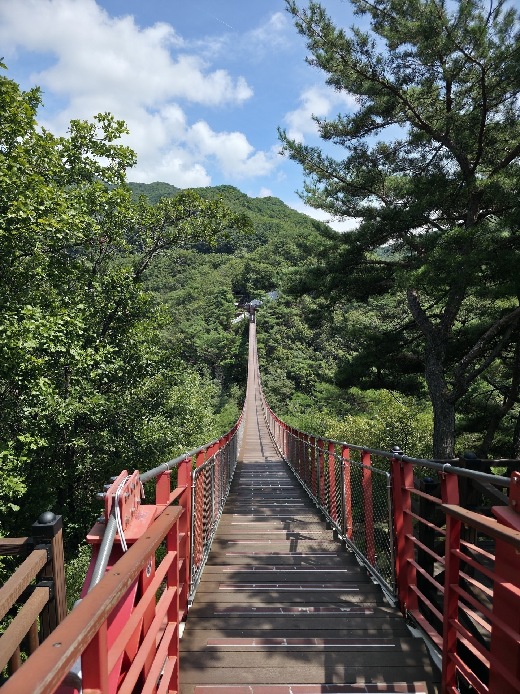
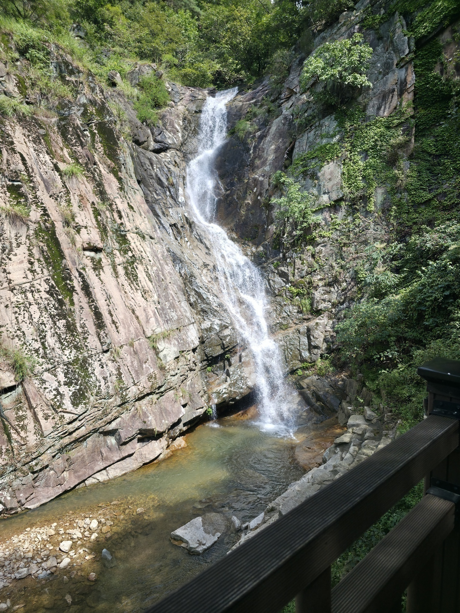
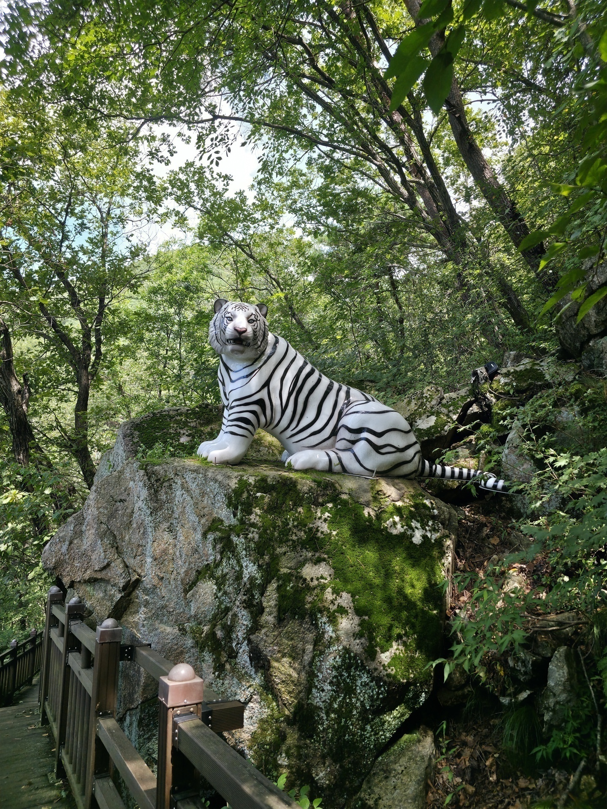
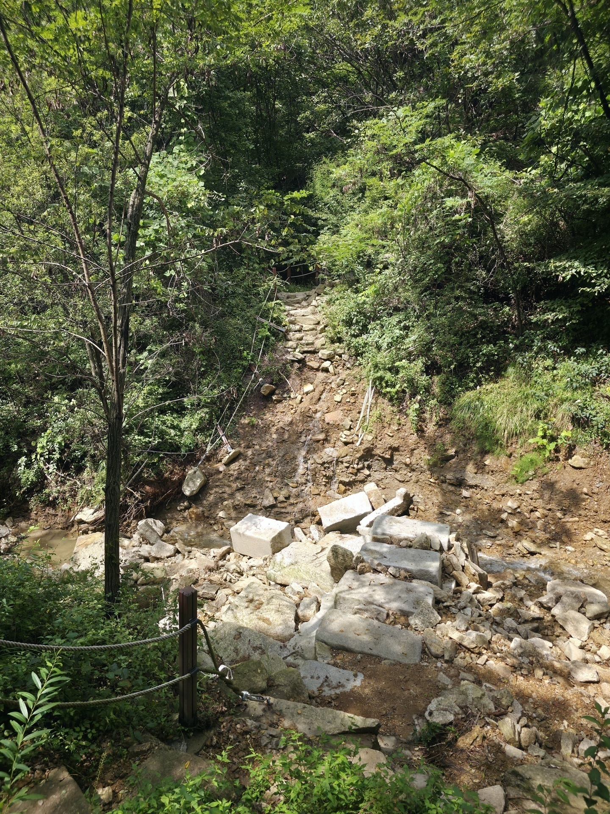
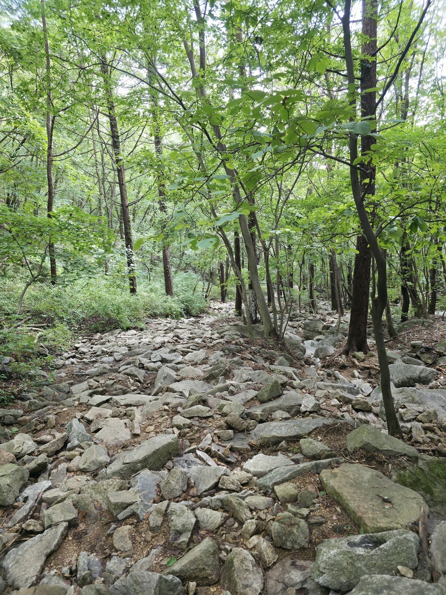
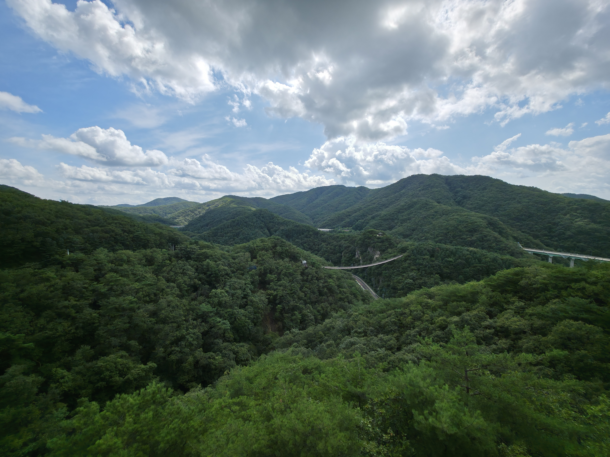

## Turen til bjerget

Jeg fandt bjerget ved at kigge rundt på maps og så der var en del bjerge i Norden så jeg tænkte hvorfor ikke prøve en af dem.

Jeg tog toget i 1 time og 30 min og kom til en lille by kaldet yanju, hvor jeg så skulle have busen fra. Jeg stod og kiggede på youtube mens jeg ventede, pludselig er der en koreaner der spørger om hvor jeg fra og hvad jeg laver her? Fordi han har ikke set en europæere her før, eftersom det ligger så langt væk fra alting. Jeg begynder så at snakke med ham og forklare om Danmark indtil min bus kom, som jeg skulle have en extra time og 40 min.

Så efter en 3 timers rejse er jeg endelig ved bjerget

## op af bjerget
Turen hen til bjerget består af at gå op af en bakke og så gå hen over en hænge bro

På den anden side af broen og lidt højere op af bjerget fandt jeg et vandfald.

Lidt højere op fandt jeg også en ny ven der sad og ventede på mig

Men herfra var det så bare op og op, jeg fandt dog hurtigt ude af at det her ikke ville være ligeså nemt som de andre bjerge. Vejen op var nemlig gået i stykker pga regn og oversvømmelse.

Men eftersom det ikke havde regnet hele dagen hverken i dag eller i går, tænkte jeg at resten af vejen stadig fungeret, det gjorde den også til en hvis grad. Det var en lang vej af sten og sten og atter sten.

Det fortsatte sådan resten af vejen, men jeg må desværre sige at det her er det første bjerg jeg ikke kunne klare at gå op af. Jeg elsker dyr som i jo nok ved, der er dog 2 dyr i verden jeg ikke vil have noget med at gøre når jeg er ude og gå, skorpion og slanger.... 

Men her var jeg på vej op af de her sten og vælger så at kigge ned til venstre for mig, hvad ser jeg ligge der? 5 slanger bare stirre på mig, med den ene krumme sig sammen, jeg har aldrig skredet fra noget så hurtigt, og med det samme ned af bjerget igen.

## Ned
På vej ned tog jeg en anden vej som der stod man kunne tage, denne her vej tog mig forbi en udkigspost som vendte ud over broen

Men selvom udsigten var fantastisk, var vejen ned horribelt, der var nemlig ikke rigtigt en vej så skulle bare gå ned af siden af bjerget og ALLE edderkopper i Sydkorea havde besluttet sige for skulle bo der.

Hvis I nogensinde kommer til det her bjerg, bestig det i lange armer og bukser, samt bare tag den normale vej ned den er så meget bedre.

Da jeg så endelig kom ned igen, var det bare hjem med busen og i seng

---

