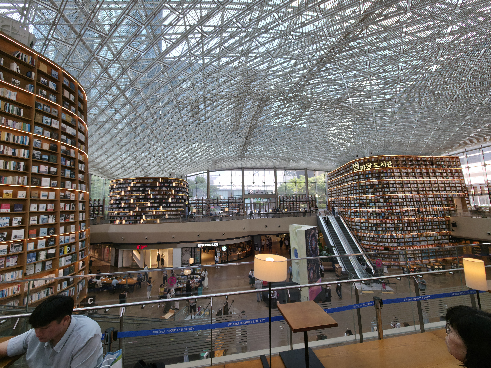
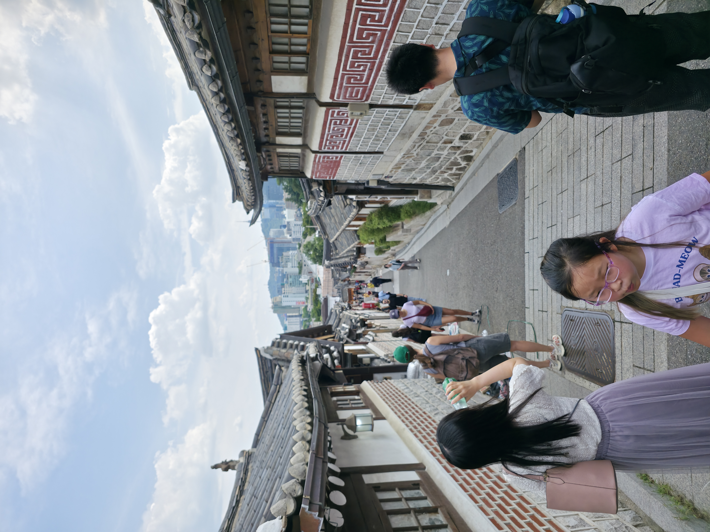
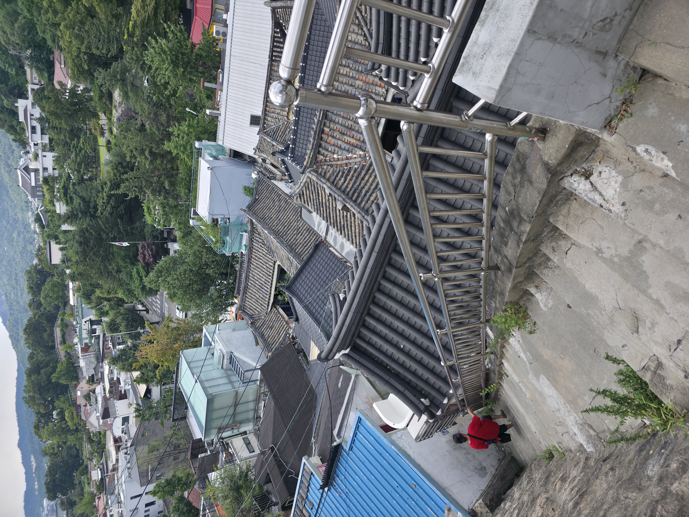

## bibliotek

Efter som det var min sidste dag, tænkte jeg at jeg måske skulle prøve, at se nogen af de store tourist ting istedet for bjerge. Jeg tog derfor til et meget populært bibliotek, jeg må sige at ja det var pænt og stort men kan ikke se hvorfor det skulle være så populært.

Jeg fandt dog en bog om programmerings algoritmer, så jeg endte med at bruge en del timer her inde alligevel, efter det valgte jeg at tage til et andet tourist sted, hanok village.

## Hanok Village

Hanok village skulle være en kulturel landsby, hvilket det nok også ville være, hvis det ikke var pga hæren af tourister.

Det gad jeg ikke have noget med at gøre, så jeg begyndte at gå ned af side veje.

Og side vejene var meget federe og hyggeligere, end at være sammen med alle touristerne, men ville dog mene at landsbyen er spil af tid og ren tourist ting.

Det var så det for den dag, fik noget at spise og gik i seng for at være parat til tage afsted dagen efter.

---

