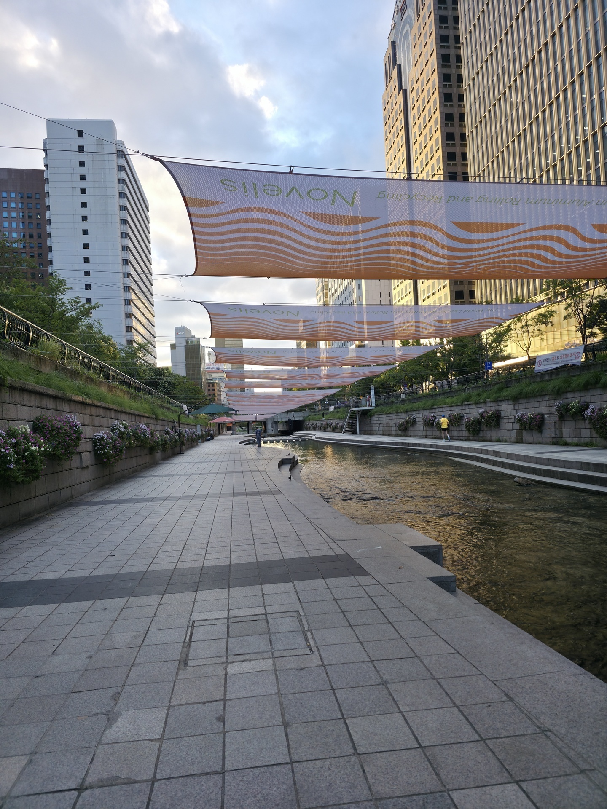

## Indledning
Det her var en lang dag, så var ikke sikker på om jeg skulle dele den op i flere dele eller ej, men nu har jeg valgt at gøre det til et helt indslag

## Morgen
I ved jo godt jeg ikke sover særlig lang tid, så kl 3 vågnede jeg (alarmen var sat til kl 8), og kunne ikke sove mere. Jeg valgte derfor at være produktiv og dele de ting jeg gerne ville se ind i mere organiseret grupper, så jeg vidste hvad jeg kunne se samme dag. 

I løbbet af natten havde jeg også fået krampe i min venstre leg, så jeg havde sagt til mig selv at jeg ikke ville gå så meget i dag og jeg ikke skulle op af nogen bjerge....

Jeg fandt frem til at i dag, ville jeg tage hen og prøve at få billetter til at se spider-man brand new day, i deres IMAX, da den skulle være længder bedre end den vi har i DK. Efter det ville jeg så tage i et shopping center kaldet lotte world mall. Jeg opdagede det her center sidste år, men jeg opdagede det samme dag jeg skulle hjem så fik ikke tid til at udforske det fuldt. 

Kl 5:20 besluttede jeg for at gå ud og få noget morgenmad 

## Morgen tur
På min jagt efter noget morgenmad, kom jeg forbi en "lille" flod, det troede jeg ihvertfald den var, men efter jeg havde gået langs den i en time og stadig ikke var nået enden begyndte jeg at tro, den måske ikke var så lille. Jeg gik lidt længere og så så et skildt der sagde "3 km tilbage", jeg havde simpelthen fundet mig en 8km lang flod i midten af Seoul.

|  |  |
| ------------------------------------------------------ | --------------------------------------------------- |

Da jeg var kommet til enden, var jeg kommet til Seoul city hall, her ligger der et temple, men det var lukket på dette tidspunk, så jeg kunne ikke komme ind i det, hvilket ikke gjorde så meget da det sjovt nok var et temple jeg alligevel havde planlagt at se en anden dag. Da jeg var gået lidt længere kom jeg til en hyggelig plads, hvor jeg lige sadte mig ned i et par minutter.

På det her tidspunkt var kl blevet ca. 7:30, og jeg havde allerede gået 8k skridt (så meget for en rolig dag haha), IMAXen jeg skulle hen til åbnede først kl 9:30 så tænkte hvorfor ikke gå derhen, nu hvor jeg alligvel er ude. 

Men jeg gad ikke bruge et kort da jeg ville se hvor meget jeg kunne huske, og jeg synes det er sjovere at finde rundt sådan. Det første jeg gør er at gå den komplet forkerte retning...

Så jeg endte istedet ved et temple/ruin

Det har åbenbart været en borg her får i tiden, men japanerene brændte den ned da de besatte korea, så nu var der kun det her tilbage. Den her bygning havde/har religiøs betydning, hvilket nok er derfor de ikke brændte den ned, da det er ville være imod geneva. Jeg gik rundt lidt her, indtil det gik op for mig jeg var gået forkert, så tog kortet frem for at finde ud af hvilken ca retning jeg skulle gå.

## Bjerg
Jeg begyndte så at gå igen, jeg gik et par kilometer længere og fandt så en park på vejen, som jeg valgte at gå ind i

Den her park hed namsang park, hvilket jeg synes lød bekænkt men kunne ikke rigtigt finde ud af hvor det var fra. Parken havde et stort åbent areal og en masse forskellige statuer af folk fra seouls historie

Jeg synes også en ting der var sjove ved de her statuer, var at de alle samen havde Syd Koreans propaganda på dem. De snakkede alle om hvordan at Nord Korea var elendigt og folk havde det forfærdeligt (hvilket ikke er forkert), og at Syd Korea er de frie folks stat, "The Free Nation of South Korea", hviket jeg heller ikke ved hvor rigtigt er, da det er en af de lande i verden med mest overvågning og restriktioner, så jeg ved ikke lige med "Free Nation".

Jeg fortsatte med at gå rundt i parken og inden jeg havde set mig om, var jeg lige pludselig højere op end forventet

Men jeg forsatte med at gå rundt, og op af nogen trapper der var i nærhden.

jeg gik i en time mere, mens jeg gik, tænkte jeg på hvorfor det var namsang lød så bekænkt, mens det bare gik op og op og op. Da jeg endelig kom til toppen gik det op for mig, da jeg så Seoul tower, også kendt som Namsang tower

På min dag, hvor jeg ikke ville gå så meget, var jeg simplethen kommet til at gå 400 meter op af et bjerg, så kl 8:40 havde jeg gået 15k skridt. Oven i det var jeg tydeligvis også gået den forkerte vej igen, men i det mindste fik jeg lov til at se den flotte udsigt igen

Jeg brugte lidt tid her, og begyndte så ned af bjerget igen, men selfølgelig af en ny vej. Jeg valgte dog at følge gpsen den her gang, tænkte at hvis jeg kan gå så forkert 2 gange, burde jeg måske følge en der ved hvor jeg skal hen. 

Denne tanke gang havde jeg i hele 6 minutter indtil jeg fandt en trappe der gik ned til en skjult stig ned af bjerget. Trappen tog mig hen til en lang væk.

Den her væg strækker sig hele namsang bjerget, så jeg valgte ikke at følge den hele vejen, hvis jeg stadig skulle nå de planer jeg faktisk havde sat for dagen blev jeg nød til at gå videre, men fik en ny ting jeg kan lave. Jeg gik længere ned af stien og fandt en rute kaldet namsang forest trail, den skulle jeg da ned af, tænkte det ville være den hurtigeste og sjoveste vej ned af bjerget.

## Museum
Efter lidt tid var jeg kommet ned fra bjerget og fortsatte i retningen af min destination, men pludslig opdagede jeg noget ud af øjen krogen, jeg synes jeg så et eller kæmpe inde mellem nogen træer.

HOLD DA MUND det gjorde jeg også 

Jeg var kommet forbi Seoul War Museum, her var der en kæmpe udstilning af kampvogne, fly, misiller og meget mere, så jeg har bare tænkt mig at ligge en masse bileder ind her 

Udover denne udendørs udstillingen, var der også en kæmpe bygning, som havde et indendørs museum. Foran denne bygning, var der også en hyldest til alle de lande der hjalp Korea under deres borger krig. Jeg ved ikke hvor meget i har fuldt med i historie men ellers kender i nok sangen jutlandia af kim larsen, så jeg ledte narturligvis efter danmark, og jutlandia.

Og ja det var der simpelthen. Jeg havde kun set den ene side af den udendørs udstillingen så jeg gik hen mod den anden side. 

Her var der mere "politiske" udstillinger. Der var en af to brødre, som havde var blevet skildt under borgerkrigen og havnede på hver sin side af konflikten, men mirakuløst mødte hinanden på slagmarken, og blev forenet igen. Denne historie, skulle åbenbart være sand, og bliver brugt til at vise Syd Koreas drøm, om at blive forenet med Nord Korea igen.

---
## Inde i musem
Efter jeg havde set udstilingerne udendørs bevægede jeg mig indendørs, Dette var en kæmpe udstilingen på 3 etager, med interaktive udstilingen og videor, og meget mere. Så jeg gider ikke rigtig side at skrive om alt det der var her fordi så ville jeg kunne blive ved i timer. 

en ting der også var her inde var et biblotek, med en masse bøger, omkring krigen og andre ting. 

Her gik det op for mig hvor står en "nørd" jeg er, og kunne ikke lade være med at grine lidt af mig selv. Her er jeg i et kæmpe krigs museum, og det jeg var mest interesseret i og brugte mest tid i var deres museum hahaha. Jeg gik rundt og kiggede på bøgerne, fandt nogen der var interessante og læste lidt, så pludselig var kl blevet 12. 

Jeg valgte at sige jeg mødte til at komme videre hvis jeg skulle nå alt det jeg ville, så jeg begyndte at gå mod IMAXen for 4. gang.

## Yongsang I-Park
Hvad jeg ikke vidste var at denne IMAX, lå i det største shopping center jeg længe har set, 12 etager og ektremt lang, tror der ville kunne 3 af strøget i den. Jeg har ikke fået taget billeder af den, da min tlf kun havde 20% tilbage, så kan ikke vise den. Men der var butikker for alt, møbler, deserter, resturanter, tøj, stort set hvis du kunne tænke det var der en butik for det. 

Jeg fandt også en specifik butik jeg valgte at tge billeder af.

Der var en hel butik kun til marvel ting, med figure, tegneserie film hele mulevitten. Eller det vil sige det var næsten kun marvel, da jeg var på vej ud af butikken, så jeg en person der vidst ikke hørte til der

Sidst jeg tjekkede var stitch ikke en del af marvel, men hej hvad ved jeg, kan godt være den koreanske avengers tager til hawaii. 

Jeg fik købt min IMAX billet, til at se spiderman d. 3 aug, og nu valgte jeg så at tage hjem, så jeg kunne oplade min tlf.

## Ud igen
kl 15 efter jeg havde ladet min tlf op, og været i bad, valgte jeg så at tage til et andent shopping center jeg så på vej hjem. 

Det her shopping center var lige så stort som det andet jeg lige havde været i, jeg ved ikke hvad pointen er at have så mange kæmpe shopping centre lige ved siden af hinanden (20 min mellem med offentlig). Jeg må dog give dem at de er meget imponerende, her gik jeg rundt ind til kl 17, og tog så hen mod LoL Park igen, så jeg kunne få noget aftensmad mens jeg så det. 

Jeg var hjemme igen kl 20 og gik i gang med at skrive om de sidste 2 dage, nu er kl 23 og jeg vil afslutte min "rolige" 40k skridt dag haha

---
