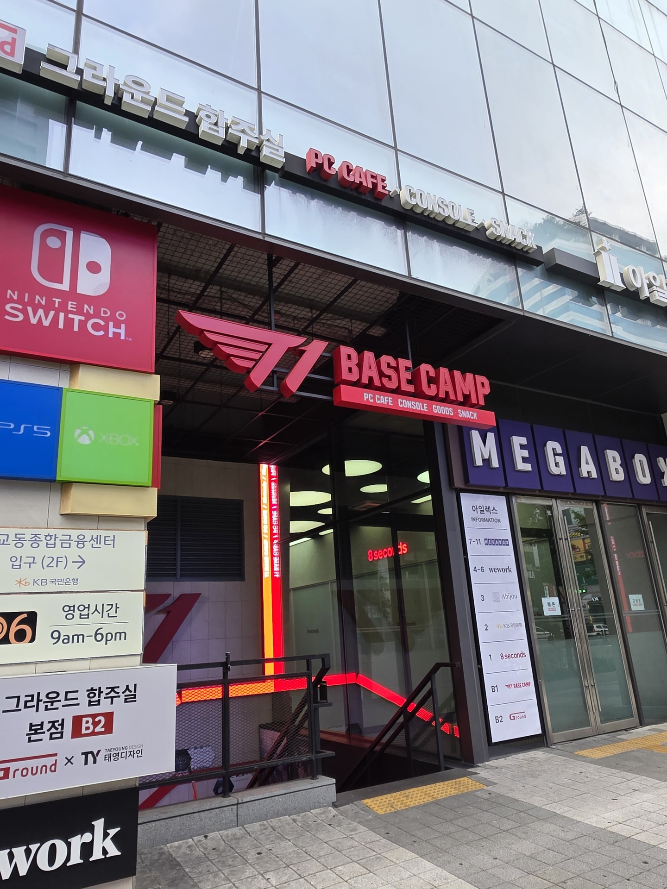
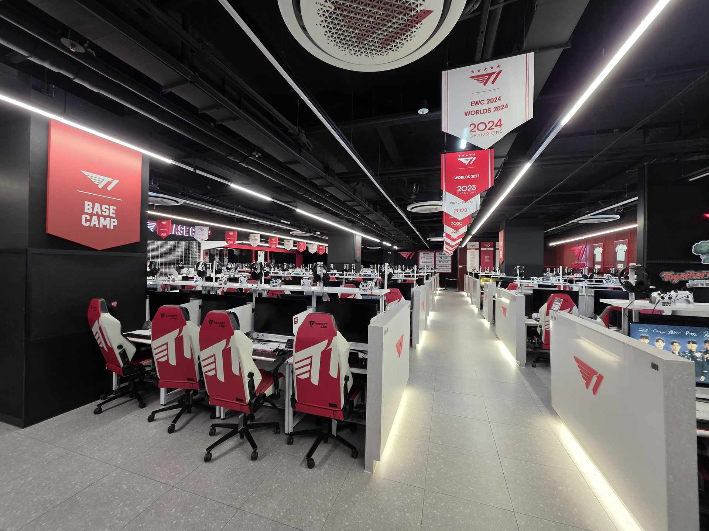
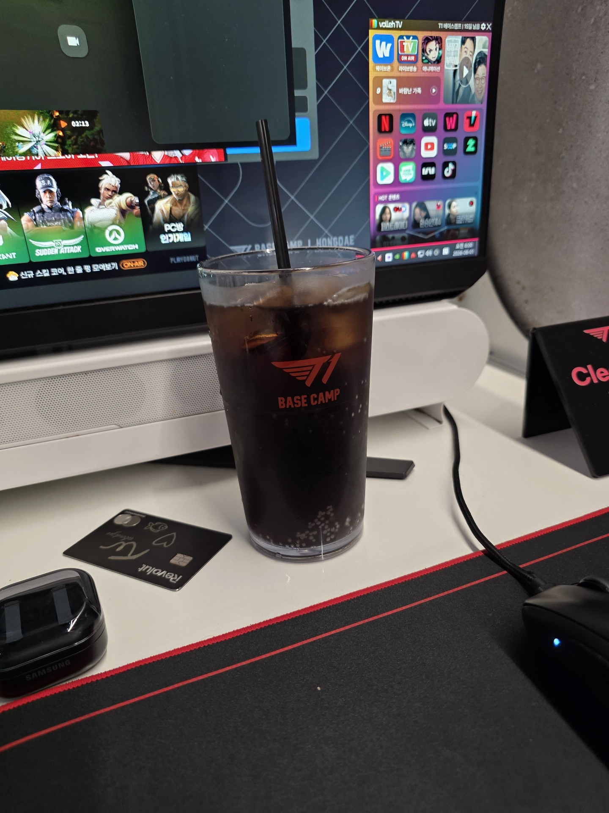

## Morgen

Et problem der er med korea er at alting er lukket til kl 10:30, så at finde ud af hvad man skal lave indtil der, hvis man ikke bestiger et bjerg er svært. Jeg havde nemlig sagt til mig selv at i dag SKULLE jeg slappe af, fordi nu havde jeg ondt i begge ben. Jeg ledte derfor efter ting man kunne lave, og kom i tanke om noget der hedder "PC bang", det er et meget populært koncept i korea, hvor man kan bruge PC  og få mad mens man bruger dem. De fleste PC bang, har åbent 24/7, og fandt ud af det det hold jeg kan lide i LCK, også har deres egen, som jeg ikke var i sidste år så jeg tænkte jeg skulle derhen.

Jeg bestile en computer til brug i 2 timer, da kl var 8, så når jeg var færdig ville tingene, jeg ville se i dag være åbnet. Jeg var ikke rigtigt sulten, så jeg bestilte mig bare ne pepsi max

Efter at min tid var gået, tog jeg mod lotte world mall, det shopping center jeg havde snakket om før. Jeg kan se jeg fuldkommen har glemt at tage billeder af det, men det var et 14 etagers shoping center, meget større end IPark, med mange flere forskellige butikker, og resturanter. Jeg brugte det meste af dagen her, tog så hjem og fandt noget at spise og det var den dag. En stille og rolig dag da min krop sagde at den gerne ville have en pause.

---
