## Seoul forrest
Jeg tog mod Seoul Forest, de skulle have en international have udstilling, som jeg tænkte kunne være interressant, Jeg endte dog med ikke at se noget af udstilling, fordi jeg kigget på andre ting. Det første jeg så var er lille hus de havde lavet til bierne i området

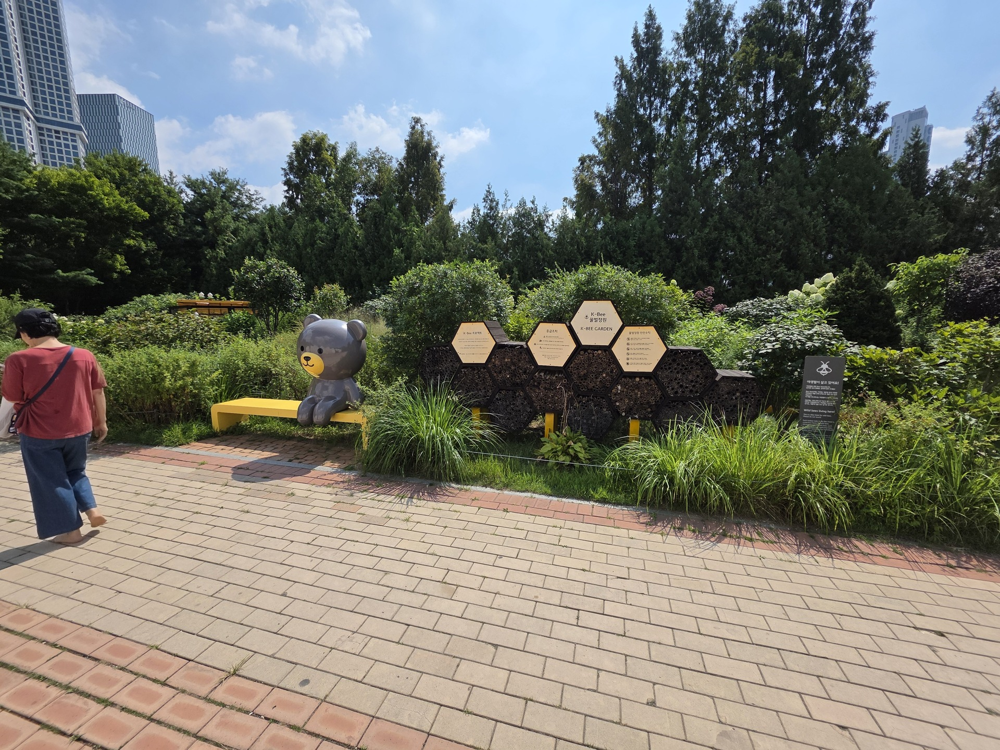

Efter det kom jeg fordi "waterfall of wishes", men jeg må sige, jeg tror at vandfaldet enten ikke har fået nok ønsker, eller er løbet tør for energi til udfylde ønsker, fordi det så meget trist ud.

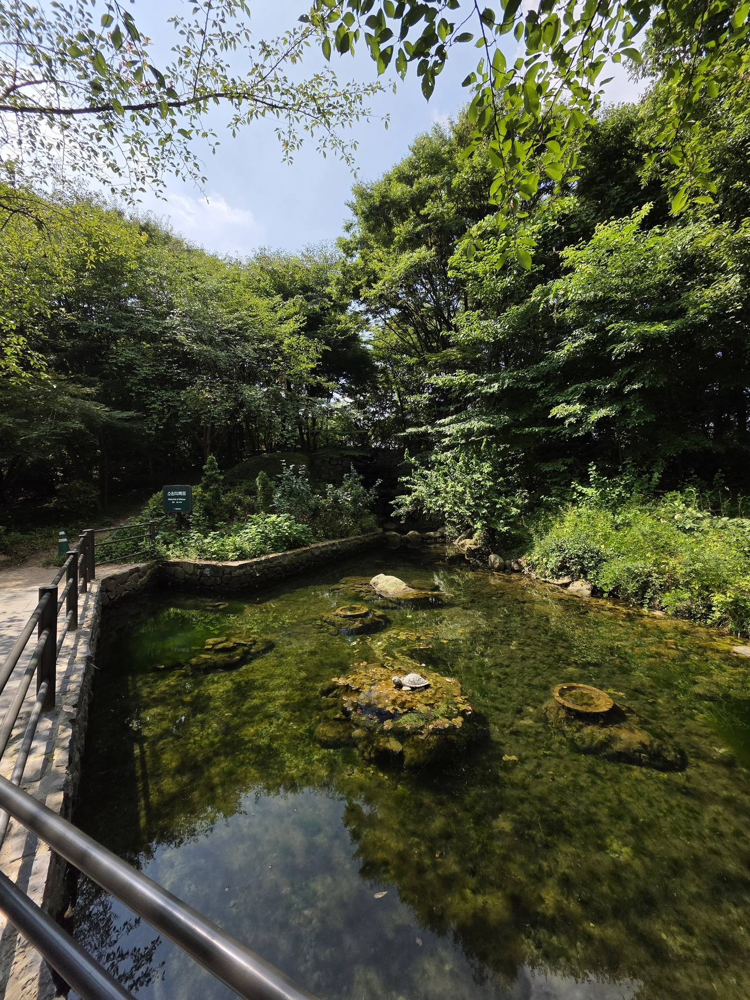

Der var også et område med dådyr i skoven, Jeg tror man kunne gå ind til dem, hvis man spurgte en der arbejdede men gjorde det ikke.

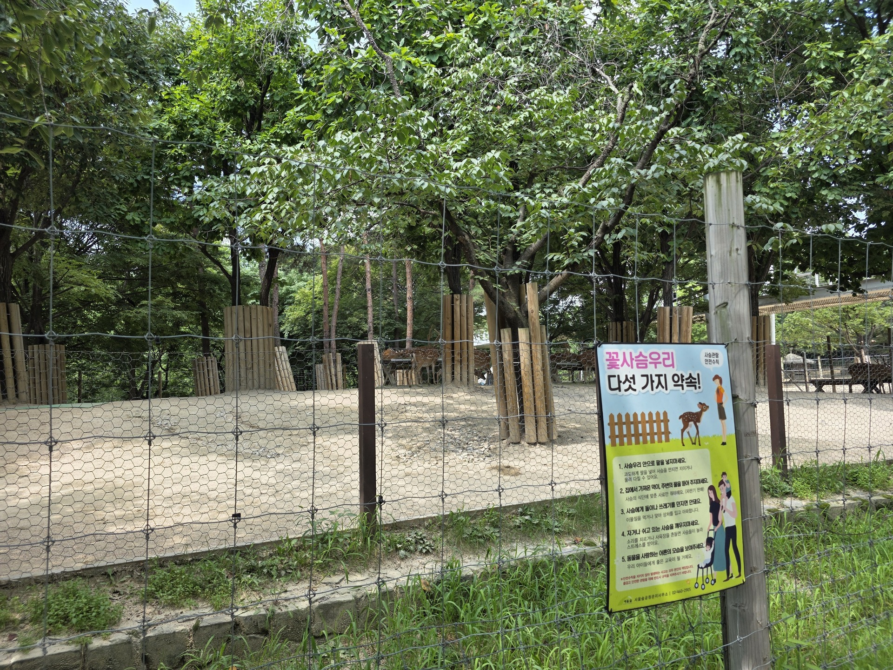

## Han river

Jeg fandt istedet en bro, og den måde jeg har kørt min tur på den her gang der er hvis jeg ser noget der virker interessant, går jeg bare hen til det, fordi jeg har meget svært ved at beslutte mig hvis jeg skal vælge mellem ting. Jeg lavet derfor bare reglen, "ser du noget interessant, gør det istedet, medmindre mens du på vej der hen det du lavet før virker mere interessant". Og indtil videre har det ikke fejlet.

Den her bro gik over motervejen og hen til en kæmpe flod der går igennem hele sydkorea (Han river)

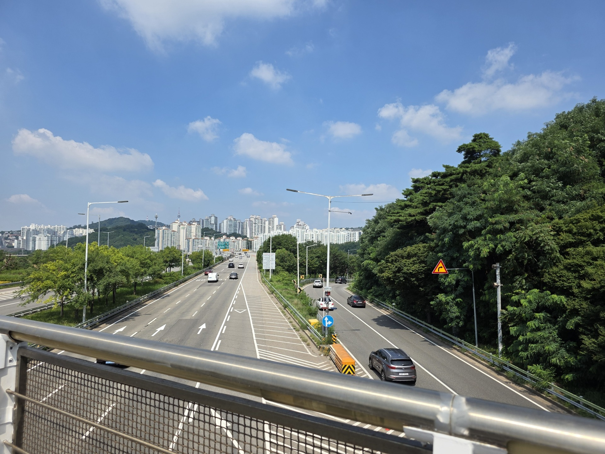
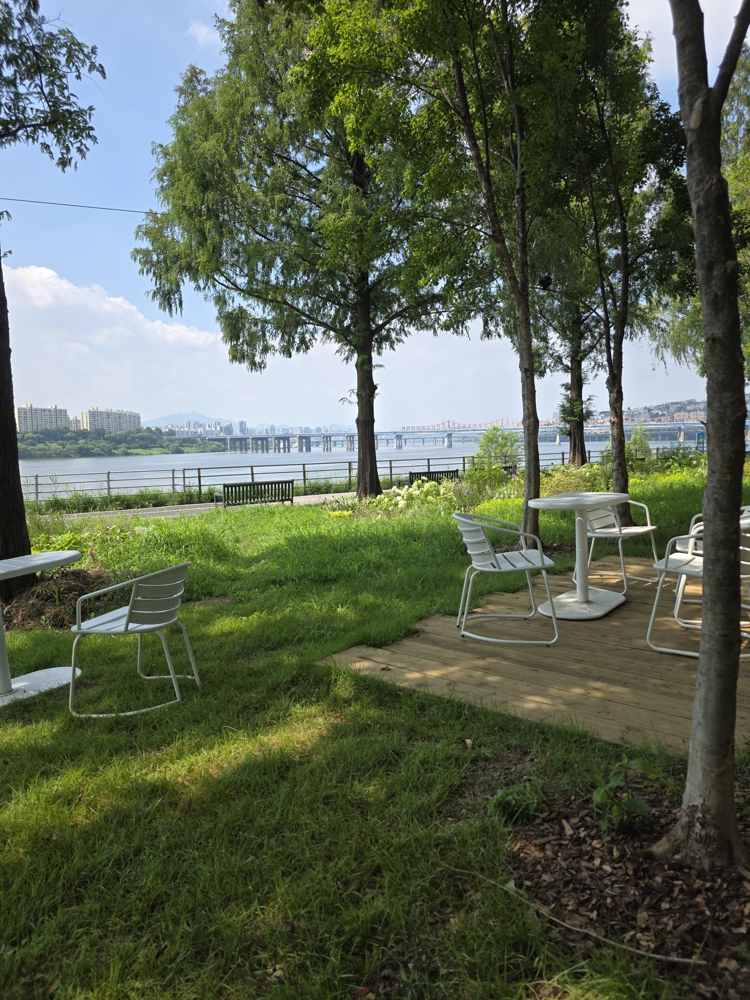

Jeg havde faktisk planlagt at se noget der lå ud til Han River, så jeg tænkte hvorfor ikke gå derhen

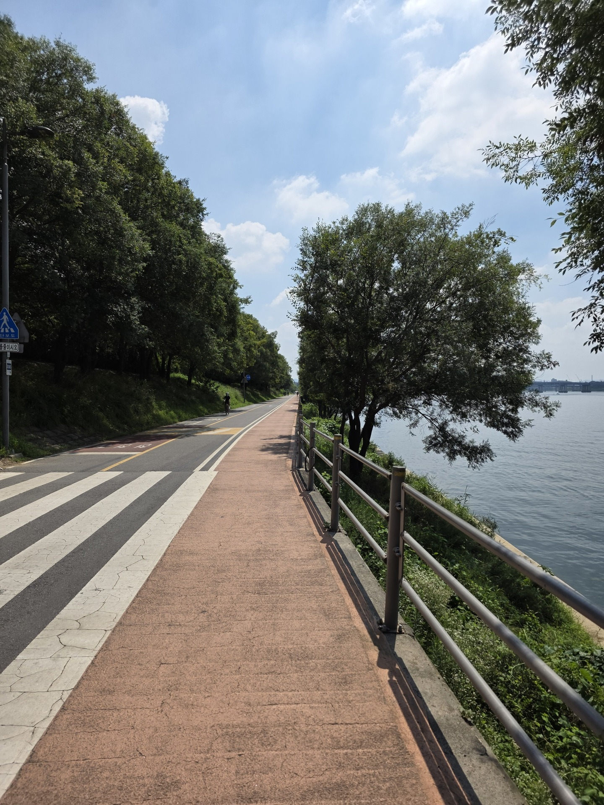

Efter at have gået i noget tid, gik stien under en bro, og under den her bro var der simpelthen et udenførs fitness område. 

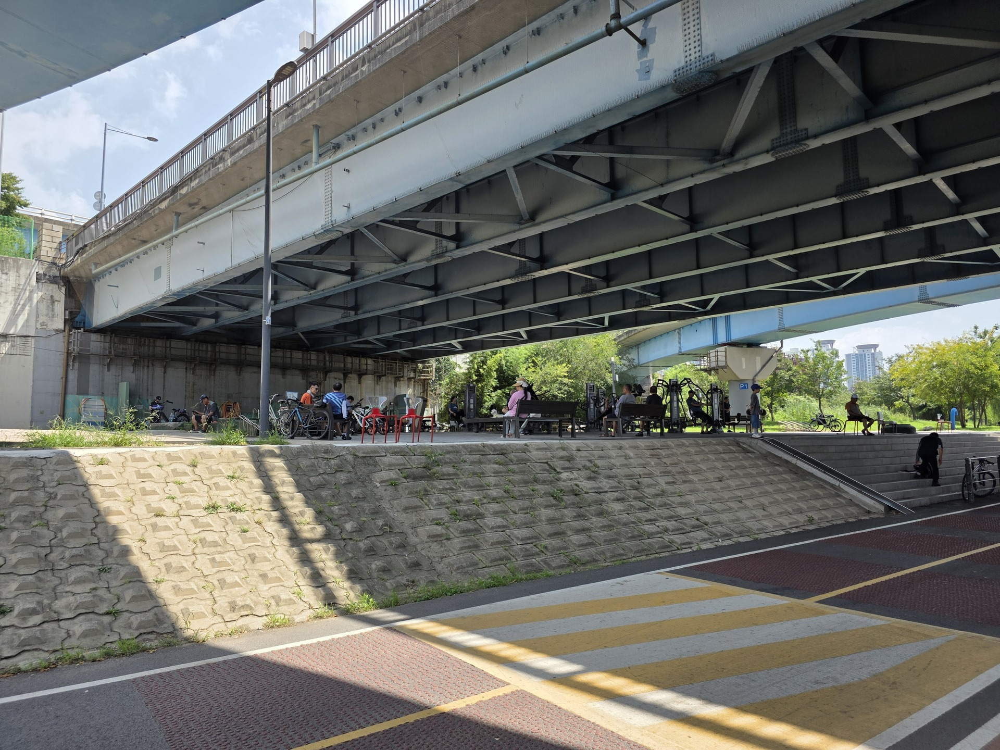

Der var vægte og hele mulevitten, og en masse mennesker der brugte det. Jeg stod og tænkte på det ville være fedt hvis vi havde sådan noget i Danmark, men det hele ville nok blive stjålet. Jeg forstsatte indtil jeg kom til en mærkelig struktur

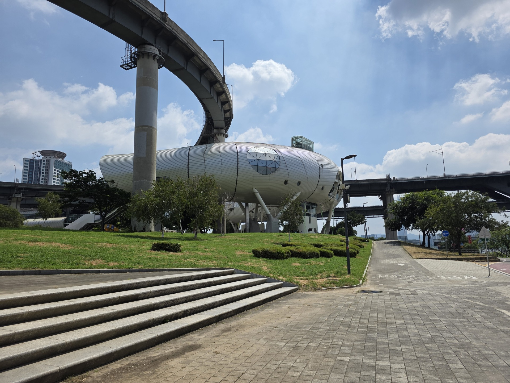

Jeg kunne også se på min GPS at jeg var lige i nærheden af det jeg var på hen til, så tænkte "hmm det kunne være det", men nej da jeg kom rundt om bygningen så jeg at jeg simpelthen havde gået mod et vand land og det var derfor jeg havde hørt om det 

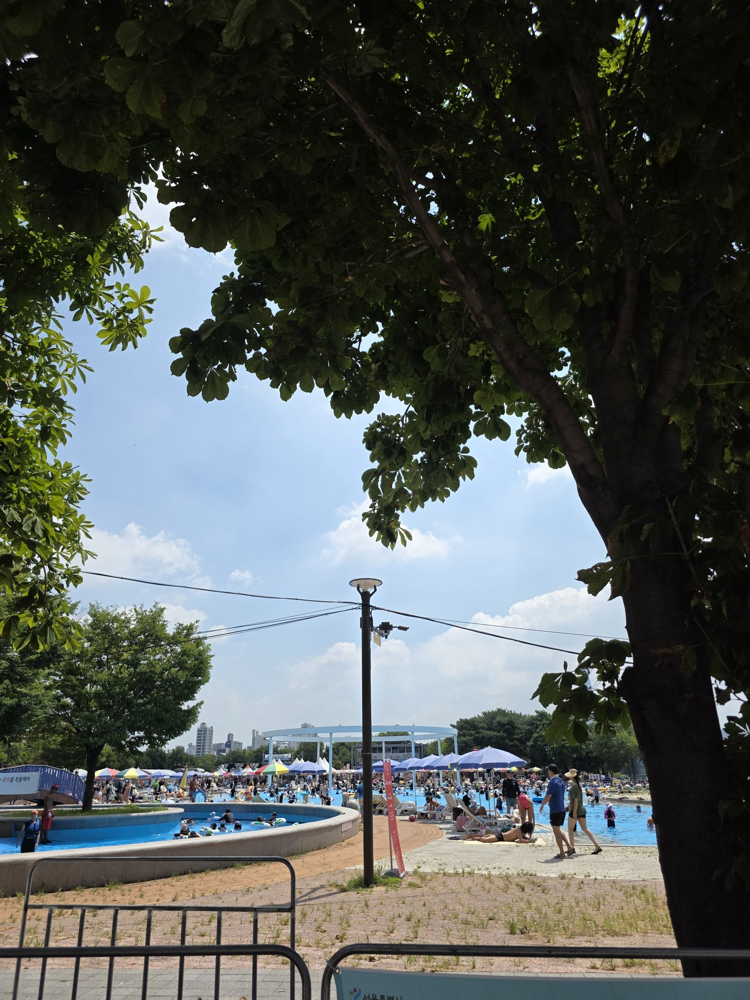

## Bjerg

Jeg valgte derfor at tage op i bygningen, men den var ikke særlig interessant, det var bare en bygning med aircon, hvilket var meget rart da der var 35 grader, men jeg valgte at hoppe på metroen og tage mod et vandfald jeg havde set på kortet. 

Jeg så også der var en sti op af siden af det her bjerg, så jeg tænkte jeg skulle selvfølgelig op af det her bjerg også. 

Jeg må sige at jeg er ved at løbe tør for ting at sige om de her bjerge, fordi de er meget ens at gå op af medmindre det er et kæmpe et som Bukhansan, så jeg tænkte istedet jeg ville fortælle lidt om hvad i kan forvente der sker, hvis i selv går i de her bjerge.

### Checklist

1. Sørge for at have nok vand, istedet for at tænkte ligesom mig, "oh det her bjerg er halvt højt så istedet for 3 flasker vand klare jeg mig med 1,5 flasker" når der er 35 grader med sky fri himmel, bliver det meget hurtigt for lidt vand.

2. Lige meget hvor hurtig du er VIL du blive indhentet af en gammel koreans bedste far, der komme gående i deres grønne tshirt, lang sorte bukser, sol hat, et håndklæde om skulder og armene på ryggen med en enkelt flaske vand og deres tlf i hånden, de flyver op af bjerget som om de gik turen hverdag til og fra skole.

3. Turen op til bjerget vil du komme forbi et udendørs fitness område og på en eller anden måde er der ALTID, nogen der træner lige meget tidspunket.

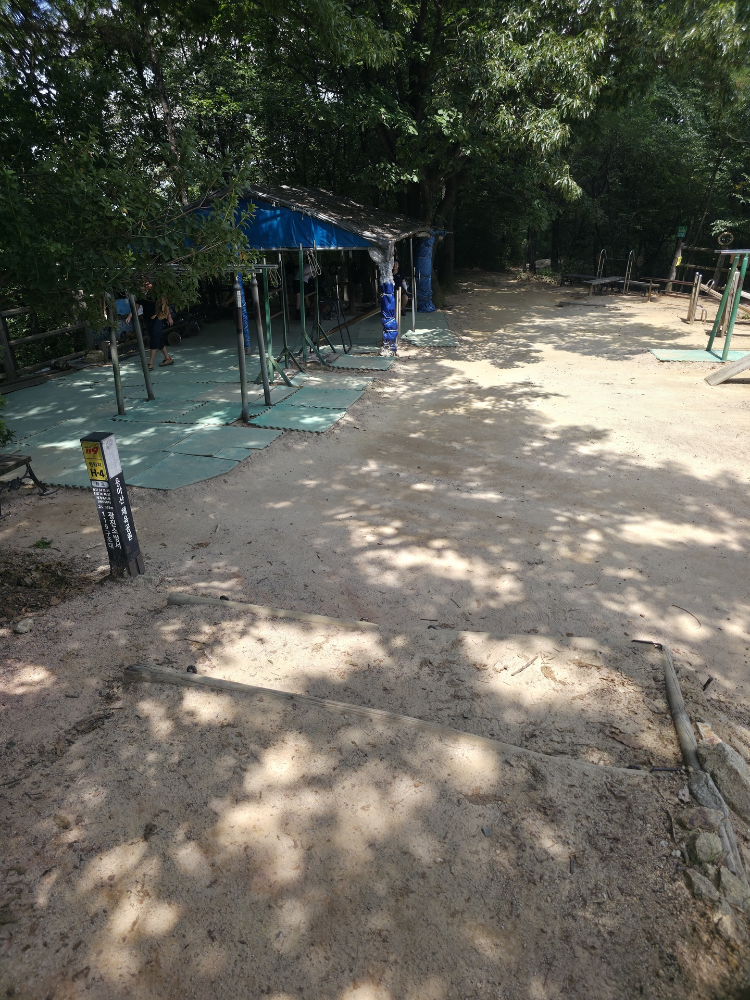

4. Det kommer til at føles som helvede, hvis du ikke har nok vand, og din krop vil be dig om at gå ned.

Men det vigtigeste punkt er når du kommer til toppen, vil det føles fantastisk og de bliver forelsket i udsigten, og er villig til at gøre det 5 gange mere dagligt.

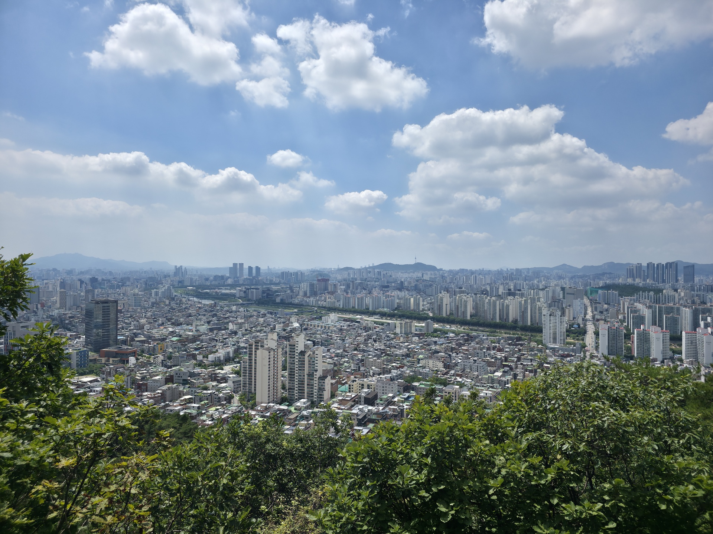
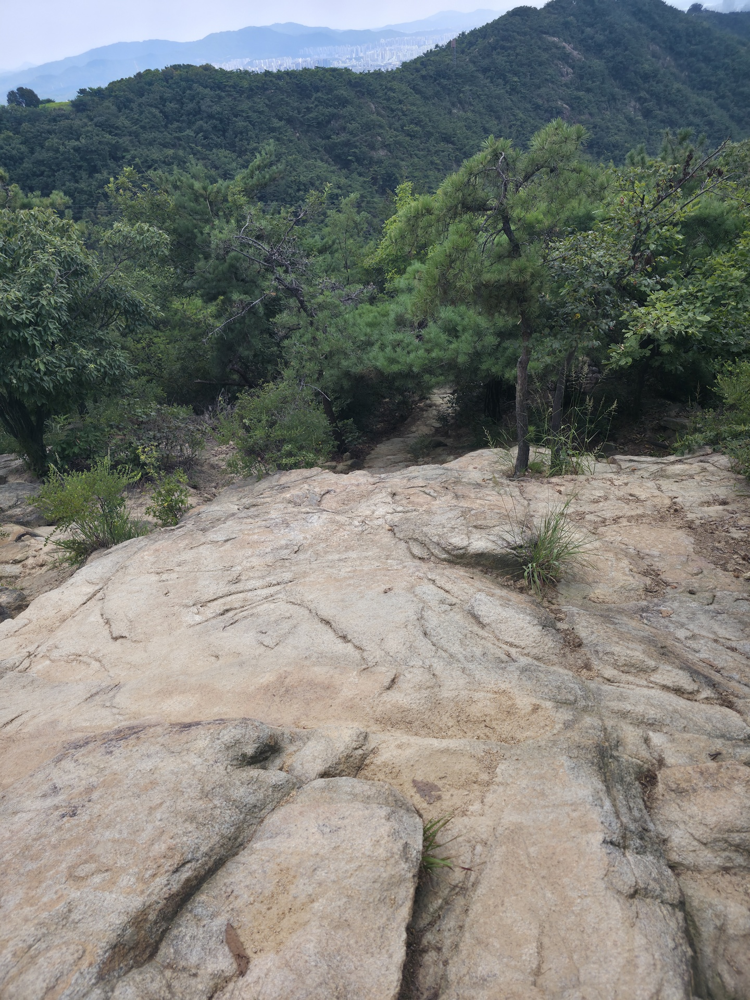

Det var dog en til at sige om det her bjerg, toppen af det havde et dejlig natur areal, som de andre ikke har haft

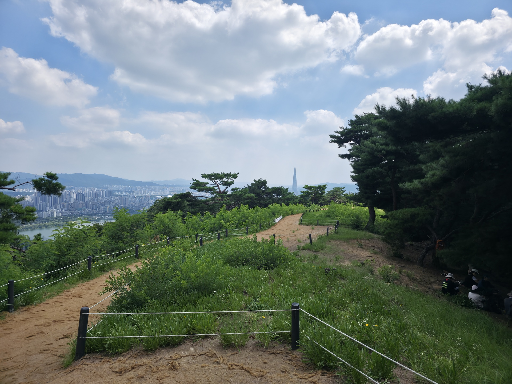

Det var det jeg havde taget billeder af for den dag, resten af dagen gik på at gå rundt i området for foden af bjerget og opleve det.

---
